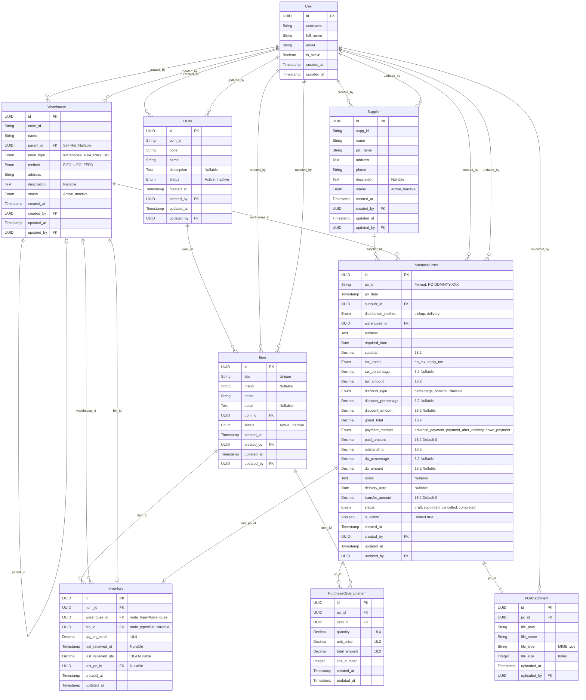

# ERP Nimbus - Entity Relationship Diagram (ERD)

**Version:** 1.0
**Based on:** PRD V6.1 (Section A.8 & B.8)
**Date:** 02 February 2026
**Principle:** 1:1 dengan PRD - Tidak ada asumsi atau tambahan

---

## 1. ERD Diagram (Mermaid)

---

## 2. Entity Definitions (Copy Exact dari PRD)

### 2.1 User (PRD Section A.8.6)

> **Note dari PRD:** Full User authentication and management is out of scope for this PRD. This entity definition is provided for foreign key reference purposes only. The system assumes a logged-in user context is available.

| Field | Type |
|-------|------|
| id | UUID |
| username | String |
| full_name | String |
| email | String |
| is_active | Boolean |
| created_at | Timestamp |
| updated_at | Timestamp |

---

### 2.2 Warehouse (PRD Section A.8.1)

| Field | Type |
|-------|------|
| id | UUID |
| node_id | String |
| name | String |
| parent_id | UUID (Self-Ref, Nullable) |
| node_type | Enum (Warehouse, Aisle, Rack, Bin) |
| method | Enum (FIFO, LIFO, FEFO) |
| address | String |
| description | Text (Nullable) |
| status | Enum (Active, Inactive) |
| created_at | Timestamp |
| created_by | UUID (Foreign Key → User.id) |
| updated_at | Timestamp |
| updated_by | UUID (Foreign Key → User.id) |

**Computed Fields (dari PRD):**

| Field | Type | Description |
|-------|------|-------------|
| full_path | String | Calculated hierarchy path (e.g., "WH0001 > A0001 > R0001") |

---

### 2.3 Supplier (PRD Section A.8.2)

| Field | Type |
|-------|------|
| id | UUID |
| supp_id | String |
| name | String |
| pic_name | String |
| address | Text |
| phone | String |
| description | Text (Nullable) |
| status | Enum (Active, Inactive) |
| created_at | Timestamp |
| created_by | UUID (Foreign Key → User.id) |
| updated_at | Timestamp |
| updated_by | UUID (Foreign Key → User.id) |

---

### 2.4 Item (PRD Section A.8.3)

| Field | Type |
|-------|------|
| id | UUID |
| sku | String (Unique) |
| brand | String (Nullable) |
| name | String |
| detail | Text (Nullable) |
| uom_id | UUID (Foreign Key → UOM.id) |
| status | Enum (Active, Inactive) |
| created_at | Timestamp |
| created_by | UUID (Foreign Key → User.id) |
| updated_at | Timestamp |
| updated_by | UUID (Foreign Key → User.id) |

---

### 2.5 UOM (PRD Section A.8.4)

| Field | Type |
|-------|------|
| id | UUID |
| uom_id | String |
| code | String |
| name | String |
| description | Text (Nullable) |
| status | Enum (Active, Inactive) |
| created_at | Timestamp |
| created_by | UUID (Foreign Key → User.id) |
| updated_at | Timestamp |
| updated_by | UUID (Foreign Key → User.id) |

---

### 2.6 Inventory (PRD Section A.8.5)

| Field | Type |
|-------|------|
| id | UUID |
| item_id | UUID (Foreign Key → Item.id) |
| warehouse_id | UUID (Foreign Key → Warehouse.id, where node_type='Warehouse') |
| bin_id | UUID (Foreign Key → Warehouse.id, where node_type='Bin', Nullable) |
| qty_on_hand | Decimal(18,4) |
| last_received_at | Timestamp (Nullable) |
| last_received_qty | Decimal(18,4) (Nullable) |
| last_po_id | UUID (Foreign Key → PurchaseOrder.id, Nullable) |
| created_at | Timestamp |
| updated_at | Timestamp |

**Unique Constraint:** (item_id, warehouse_id, bin_id)

---

### 2.7 PurchaseOrder (PRD Section B.8.1)

| Field | Type |
|-------|------|
| id | UUID |
| po_id | String (Format: PO-DDMMYY-XXX) |
| po_date | Timestamp |
| supplier_id | UUID (Foreign Key → Supplier.id) |
| distribution_method | Enum (pickup, delivery) |
| warehouse_id | UUID (Foreign Key → Warehouse.id) |
| address | Text |
| required_date | Date |
| subtotal | Decimal(18,2) |
| tax_option | Enum (no_tax, apply_tax), Default: no_tax |
| tax_percentage | Decimal(5,2) (Nullable) |
| tax_amount | Decimal(18,2) |
| discount_type | Enum (percentage, nominal), Nullable |
| discount_percentage | Decimal(5,2) (Nullable) |
| discount_amount | Decimal(18,2) (Nullable) |
| grand_total | Decimal(18,2) |
| payment_method | Enum (advance_payment, payment_after_delivery, down_payment) |
| paid_amount | Decimal(18,2), Default: 0 |
| outstanding | Decimal(18,2) |
| dp_percentage | Decimal(5,2) (Nullable) |
| dp_amount | Decimal(18,2) (Nullable) |
| notes | Text (Nullable) |
| delivery_date | Date (Nullable) |
| transfer_amount | Decimal(18,2), Default: 0 |
| status | Enum (draft, submitted, cancelled, completed), Default: submitted |
| is_active | Boolean, Default: true |
| created_at | Timestamp |
| created_by | UUID (Foreign Key → User.id) |
| updated_at | Timestamp |
| updated_by | UUID (Foreign Key → User.id) |

> **Note dari PRD:** `delivery_date` and `transfer_amount` are user input fields populated via future payment/delivery tracking features. For MVP Phase 1, these fields default to null/0 and are displayed in PO List view.

---

### 2.8 PurchaseOrderLineItem (PRD Section B.8.2)

| Field | Type |
|-------|------|
| id | UUID |
| po_id | UUID (Foreign Key → PurchaseOrder.id) |
| item_id | UUID (Foreign Key → Item.id) |
| quantity | Decimal(18,4) |
| unit_price | Decimal(18,2) |
| total_amount | Decimal(18,2) |
| line_number | Integer |
| created_at | Timestamp |
| updated_at | Timestamp |

---

### 2.9 POAttachment (PRD Section B.8.3)

**Relationship:** One-to-One with PurchaseOrder (Max 1 attachment per PO)

| Field | Type |
|-------|------|
| id | UUID |
| po_id | UUID (Foreign Key → PurchaseOrder.id) |
| file_path | String |
| file_name | String |
| file_type | String (MIME type) |
| file_size | Integer (bytes) |
| uploaded_at | Timestamp |
| uploaded_by | UUID (Foreign Key → User.id) |

---

## 3. Field Length Standards (PRD Section A.14.2 & B.14)

### Master Data Field Lengths (PRD A.14.2)

| Entity | Field | Max Length |
|--------|-------|------------|
| Warehouse | node_id | 10 chars |
| Warehouse | name | 100 chars |
| Warehouse | address | 500 chars |
| Warehouse | description | 1000 chars |
| Supplier | supp_id | 10 chars |
| Supplier | name | 100 chars |
| Supplier | pic_name | 100 chars |
| Supplier | address | 500 chars |
| Supplier | phone | 15 chars |
| Supplier | description | 1000 chars |
| Item | sku | 10 chars |
| Item | brand | 100 chars |
| Item | name | 200 chars |
| Item | detail | 1000 chars |
| UOM | uom_id | 10 chars |
| UOM | code | 10 chars |
| UOM | name | 50 chars |
| UOM | description | 500 chars |

### PO Field Standards (PRD B.14)

| Field | Data Type | Precision |
|-------|-----------|-----------|
| PO ID | String | Max 20 characters |
| Supplier Name | String | Max 255 characters |
| Address | Text | Max 500 characters |
| Quantity | Decimal | (18,4) |
| Unit Price | Decimal | (18,2) |
| Total Amount | Decimal | (18,2) |
| Subtotal | Decimal | (18,2) |
| Tax Percentage | Decimal | (5,2) - Range: 0.00 to 100.00 |
| Tax Amount | Decimal | (18,2) |
| Discount Percentage | Decimal | (5,2) - Range: 0.00 to 100.00 |
| Discount Amount | Decimal | (18,2) |
| Grand Total | Decimal | (18,2) |
| Paid Amount | Decimal | (18,2) |
| Outstanding | Decimal | (18,2) - Calculated field |
| DP Percentage | Decimal | (5,2) - Range: 0.00 to 100.00 |
| DP Amount | Decimal | (18,2) |
| Transfer Amount | Decimal | (18,2) |
| Remaining Amount | Decimal | (18,2) - Calculated field |
| Timestamps | DateTime | ISO-8601 format |
| Dates | Date | YYYY-MM-DD format (stored) |
| Notes | Text | Max 2000 characters |
| Document Path | String | Max 500 characters |

---

## 4. General Data Types (PRD Section A.14.1)

| Field Type | Data Type |
|------------|-----------|
| Phone | String (8-15 chars) |
| Prices | Decimal (18,2) |
| Quantities | Decimal (18,4) |
| Timestamps | ISO-8601 |

---

## 5. Seed Data (PRD Section E.6)

### Default UOM Values

| UOM ID | Code | Name |
|--------|------|------|
| UOM001 | Kg | Kilogram |
| UOM002 | Ltr | Liter |
| UOM003 | Pcs | Pieces |
| UOM004 | Box | Box |
| UOM005 | Pack | Pack |
| UOM006 | Unit | Unit |
| UOM007 | Set | Set |
| UOM008 | Dzn | Dozen |

---

## 6. Foreign Key Summary (Extracted dari PRD)

| Entity | Field | References | Notes |
|--------|-------|------------|-------|
| Warehouse | parent_id | Warehouse.id | Self-Ref, Nullable |
| Warehouse | created_by | User.id | - |
| Warehouse | updated_by | User.id | - |
| Supplier | created_by | User.id | - |
| Supplier | updated_by | User.id | - |
| UOM | created_by | User.id | - |
| UOM | updated_by | User.id | - |
| Item | uom_id | UOM.id | - |
| Item | created_by | User.id | - |
| Item | updated_by | User.id | - |
| Inventory | item_id | Item.id | - |
| Inventory | warehouse_id | Warehouse.id | where node_type='Warehouse' |
| Inventory | bin_id | Warehouse.id | where node_type='Bin', Nullable |
| Inventory | last_po_id | PurchaseOrder.id | Nullable |
| PurchaseOrder | supplier_id | Supplier.id | - |
| PurchaseOrder | warehouse_id | Warehouse.id | - |
| PurchaseOrder | created_by | User.id | - |
| PurchaseOrder | updated_by | User.id | - |
| PurchaseOrderLineItem | po_id | PurchaseOrder.id | - |
| PurchaseOrderLineItem | item_id | Item.id | - |
| POAttachment | po_id | PurchaseOrder.id | One-to-One |
| POAttachment | uploaded_by | User.id | - |

---

## 7. Unique Constraints (Extracted dari PRD)

| Entity | Constraint | Source |
|--------|------------|--------|
| Item | sku | A.8.3 "String (Unique)" |
| Inventory | (item_id, warehouse_id, bin_id) | A.8.5 "Unique Constraint" |
| POAttachment | po_id | B.8.3 "One-to-One with PurchaseOrder" |

---

**End of ERD Document**
