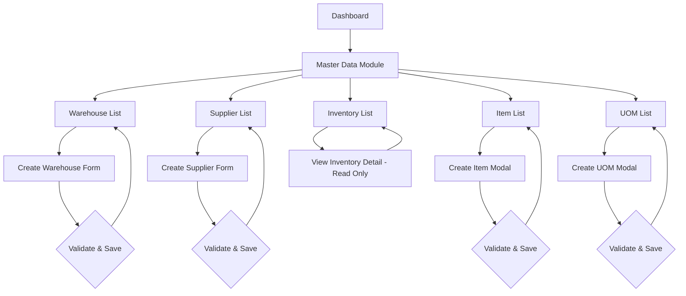
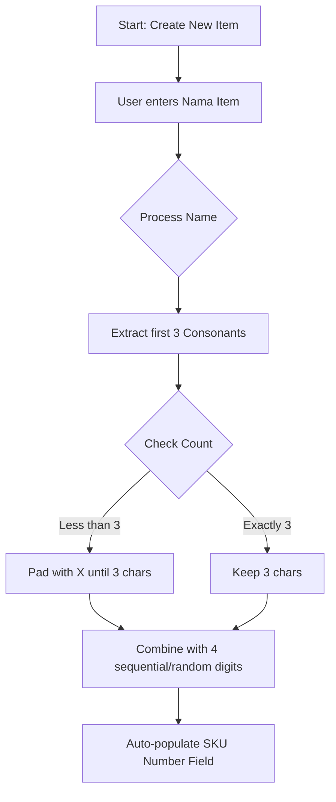
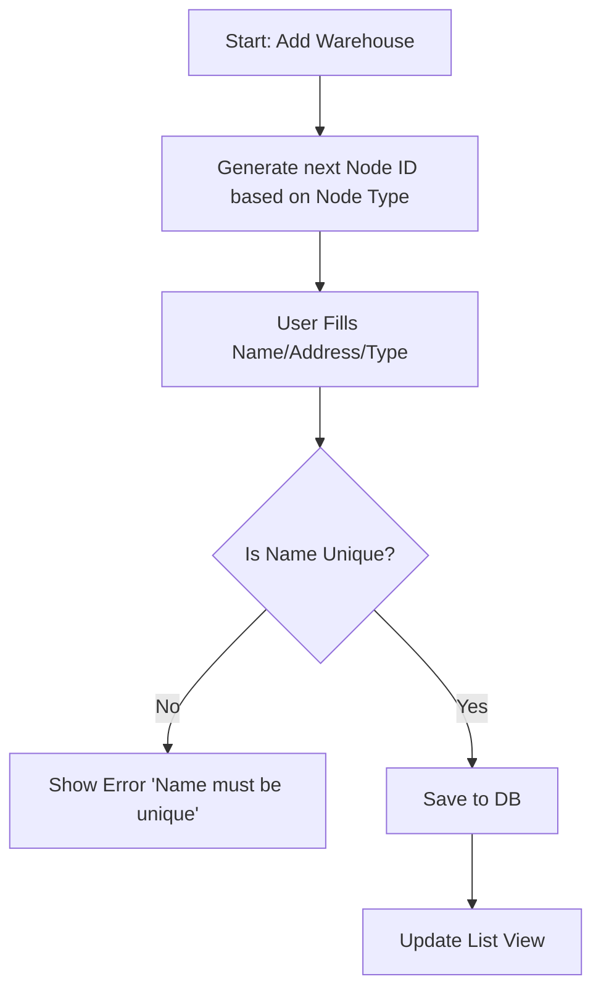
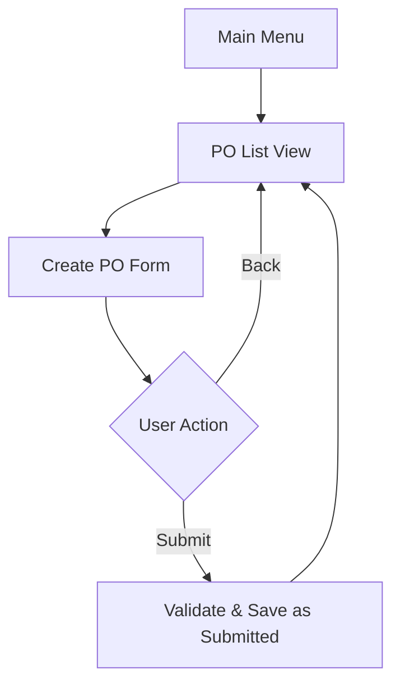
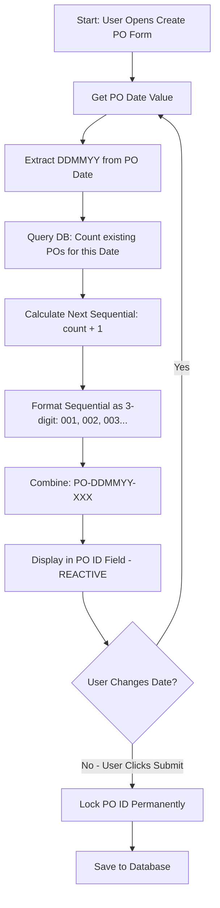
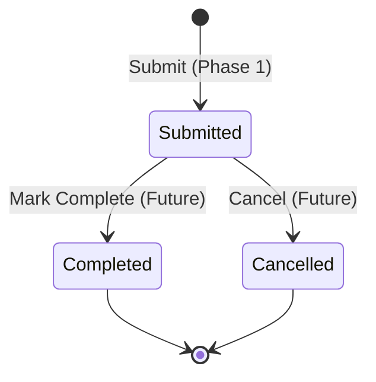

# ERP Nimbus – Product Requirements Document (PRD)

**Document Version:** 6.1 (Revised)
**Status:** Final
**Revision Date:** 02 February 2026
**Change Summary:** Clarifications from QA review (Inventory Phase 1, Status Toggle, SKU Editability, Search Standards, Address Overwrite, UOM Validation)
**Audience:** Product, Engineering, QA, AI Coding Agents, Database Architects

> **Authoritative Instruction (MANDATORY):**
> This document is the single source of truth.
> Implementers (human or AI) **MUST NOT** assume, infer, extend, optimize, or creatively interpret
> any requirement not explicitly stated in this document.

---

# PART A: Master Data Management

---

## A.1. Objective

Provide a deterministic, aesthetically pleasing, and type-safe Master Data Management (MDM) system for "ERP Nimbus," establishing the "Source of Truth" for Warehouses, Suppliers, Items, UOM (Unit of Measure), and Inventory. The system must enforce strict ID generation rules (specifically SKU logic) and maintain a modern, clean user experience aligned with **AdminLTE's List View** paradigms.

---

## A.2. In Scope

- Creation and Listing of Warehouse entities
- Creation and Listing of Supplier entities
- Creation and Listing of Item entities
- Creation and Listing of UOM (Unit of Measure) entities
- Viewing Inventory levels per Item per Warehouse (read-only display)
- Automated ID/SKU generation logic (3 Consonants + 4 Numbers)
- "Soft Delete" functionality via Status toggles

---

## A.3. Out of Scope

- Manual adjustment of Inventory quantities (Inventory is display-only, updated via PO transactions)
- Barcode printing or scanning
- Import/Export of CSV data
- Multi-warehouse transfer transactions
- Edit functionality for Master Data records (MVP)
- Delete functionality for Master Data records (MVP)

> **Phase 1 Status Management Limitation:**
> Since Edit functionality is out of scope for Phase 1, the Status field (Active/Inactive) **cannot be changed after record creation**. The Activate/Deactivate toggle is part of the Edit form which is not available in Phase 1. Users must set the correct Status value during initial record creation. Status toggle functionality will be available when Edit is implemented in future phases.

---

## A.4. Actors

| Actor | Description |
|------|------------|
| Warehouse Admin | Power user managing physical storage definitions, SKU creation, and viewing inventory levels. |
| Procurement User | User responsible for onboarding and managing Supplier data. |

---

## A.5. End-to-End Process Flow

1. User navigates to the specific Master Data list (Warehouse, Supplier, Item, UOM, or Inventory).
2. For Warehouse/Supplier/Item/UOM: User clicks the "Create" action button.
3. System opens the specific creation interface (Form or Modal).
4. System auto-generates the unique ID (Node ID, Supp ID) or prepares the SKU logic.
5. User completes mandatory fields.
6. For Items: System generates SKU in real-time based on "Nama Item" input.
7. User submits the form.
8. System persists data and displays a success notification (Toast).
9. For Inventory: User views read-only inventory data (no create/edit actions).

---

## A.6. Screen Flow Diagram



### A.6.1 SKU Generation Logic Flow


### A.6.2 Warehouse Logic Flow


---

## A.7. Screen Definitions & Functional Requirements

### A.7.1 Warehouse Create Screen

**Purpose:** Define physical storage contexts using a Tree View hierarchy (Warehouse -> Aisle -> Rack -> Bin).
**UI Pattern:** Right-side Slide-over Form (AdminLTE Panel).

#### Fields

| Field Name | Data Type | Input Type | Mandatory | Behavior |
|----------|-----------|------------|-----------|----------|
| Node ID | String | Text Input | Yes | Auto-gen based on Node Type (see A-FR-001). Editable after auto-generation but before save. Read-only after record is saved. |
| Name | Text | Text Input | Yes | Must be unique system-wide. |
| Node Type | Enum | Dropdown | Yes | Options: Warehouse, Aisle, Rack, Bin. |
| Parent Selection | Reference | Cascading Dropdowns | Conditional | See A-FR-014 for cascading behavior. |
| Method | Enum | Dropdown | Yes | Options: FIFO (Default), LIFO, FEFO. |
| Address | Text | Text Input | Yes | Physical Address. Auto-fill from parent Warehouse (see A-FR-015). |
| Description | Text | Text Area | No | Multiline text. |
| Status | Enum | Toggle | Yes | Active / Inactive. Default: Active. |

#### Parent Selection Cascading Dropdowns (A-FR-014)

| Node Type | Step 1 | Step 2 | Step 3 | Final Parent |
|-----------|--------|--------|--------|--------------|
| Warehouse | - | - | - | None (Root) |
| Aisle | Select Warehouse | - | - | Selected Warehouse |
| Rack | Select Warehouse | Select Aisle | - | Selected Aisle |
| Bin | Select Warehouse | Select Aisle | Select Rack | Selected Rack |

**Functional Requirements**
- **A-FR-001**: Node ID SHALL auto-generate based on Node Type with separate counters. ID generation uses sequential count + 1 from existing records:
  - Warehouse: `WH` + 4 digit (e.g., WH0001, WH0002). System queries MAX(node_id) where node_type='Warehouse', extracts numeric part, adds 1.
  - Aisle: `A` + 4 digit (e.g., A0001, A0002). System queries MAX(node_id) where node_type='Aisle', extracts numeric part, adds 1.
  - Rack: `R` + 4 digit (e.g., R0001, R0002). System queries MAX(node_id) where node_type='Rack', extracts numeric part, adds 1.
  - Bin: `B` + 4 digit (e.g., B0001, B0002). System queries MAX(node_id) where node_type='Bin', extracts numeric part, adds 1.
- **A-FR-002**: Name SHALL be unique system-wide.
- **A-FR-003**: System SHALL validate that a Child Node (e.g., Aisle) has a Parent (e.g., Warehouse).
- **A-FR-014**: Parent Selection SHALL use cascading dropdowns. User must drill-down from Warehouse level to select the correct parent position.
- **A-FR-014a**: **Cascading Reset Rule:** When user changes a parent selection (e.g., changes Warehouse dropdown value), system SHALL immediately reset all downstream child dropdowns (Aisle, Rack, Bin) to empty/placeholder state. This ensures data consistency and prevents orphaned selections.
- **A-FR-015**: When creating Aisle, Rack, or Bin, Address field SHALL auto-fill from the parent Warehouse's address. User can edit after auto-fill.

### A.7.2 Warehouse List Screen

**Purpose:** View and manage existing warehouses.
**UI Pattern:** **Tree Grid View** (Standard AdminLTE Tree pattern). **Note:** Tree View does NOT use pagination - all nodes are loaded and displayed hierarchically. **Implementation Note:** Performance optimization (lazy loading, node limits, default collapse state) is an implementation decision based on actual data volume, not a PRD requirement.

#### Tree View Behavior

- **A-FR-016**: Parent nodes with children SHALL display an expand/collapse arrow icon to the left of the name.
- **A-FR-017**: Click on arrow icon SHALL toggle visibility of child nodes.
- **A-FR-018**: Default state: All nodes SHALL be expanded on page load.
- **A-FR-019**: Indentation SHALL be 24px per level.
- **A-FR-020**: Each Node Type SHALL have a distinct icon:
  - Warehouse: Building icon
  - Aisle: Rows icon
  - Rack: Grid icon
  - Bin: Box icon
- **A-FR-021**: "Expand All" and "Collapse All" buttons SHALL be available above the tree.

#### Columns
| Column Name | Data Source | Formatting |
|-------------|-------------|------------|
| Node ID | node_id | Monospace, Clickable Link |
| Full Path | (calculated) | Text, format: "WH0001 > A0001 > R0001" |
| Name | name | Bold text (Indented for tree structure) |
| Address | address | Text |
| Status | status | Badge (Active=Green, Inactive=Gray) |
| Updated At | updated_at | User Locale Date |
| Updated By | updated_by | User Name |
| Action | (System) | **View** Button |

**Functional Requirements**
- **A-FR-004**: Search bar SHALL filter by **Name** and **Node ID**.
- **A-FR-005**: View Button SHALL open the specific form in read-only mode.

#### View Mode Behavior (A-FR-005a)
When user clicks "View" button or clicks on Node ID link:
- System SHALL open the Warehouse form in **read-only mode**
- All fields SHALL be displayed but **non-editable** (disabled/readonly state)
- Form SHALL display all saved data for that record
- Form SHALL have a "Close" button to return to list
- Form SHALL NOT have an "Edit" button (Edit functionality is out of scope for MVP)

### A.7.3 Supplier Create Screen

**Purpose:** Onboard external partners.
**UI Pattern:** Centered Modal.

#### Fields

| Field Name | Data Type | Input Type | Mandatory | Behavior |
|----------|-----------|------------|-----------|----------|
| Supp ID | String | Read-only Text | Yes | Auto-gen: `SUP` + 4 digit sequence. System queries MAX(supp_id), extracts numeric part, adds 1. Sequential and ordered (e.g., SUP0001, SUP0002, SUP0003). |
| Supplier Name | Text | Text Input | Yes | Free text. |
| PIC Supplier Name | Text | Text Input | Yes | Person In Charge. |
| Alamat | Text | Text Area | Yes | Address field. |
| Phone Number | Numeric | Input (Tel) | Yes | **Rule:** 8-15 digits, must not start with 0. |
| Description | Text | Text Area | No | Optional remarks. |
| Status | Boolean | Toggle | Yes | Default: Active. |

**Functional Requirements**
- **A-FR-006**: Phone Number SHALL be 8-15 digits and SHALL NOT start with 0.
- **A-FR-007**: System SHALL validate "Alamat" is not empty.
- **A-FR-006a**: Supp ID generation SHALL be sequential and ordered. System queries database for MAX(supp_id), extracts the numeric portion, and adds 1 to generate the next ID.

### A.7.4 Supplier List Screen

**Purpose:** Directory of vendors.
**UI Pattern:** Data Table.

#### Columns
| Column Name | Data Source | Formatting |
|-------------|-------------|------------|
| Supp ID | supp_id | Monospace, Clickable Link |
| Supp Name | name | Bold |
| Alamat | address | Truncated (50 chars) |
| Phone Number | phone | Text |
| Status | status | Badge (Active=Green, Inactive=Gray) |
| Updated At | updated_at | User Locale Date |
| Updated By | updated_by | User Name |
| Action | (System) | **View** Button |

**Functional Requirements**
- **A-FR-008**: Search bar SHALL filter by **ID**, **Name**, and **Phone Number**.
- **A-FR-008b**: List SHALL support pagination with default 10 records per page.

#### View Mode Behavior (A-FR-008a)
When user clicks "View" button or clicks on Supp ID link:
- System SHALL open the Supplier form/modal in **read-only mode**
- All fields SHALL be displayed but **non-editable** (disabled/readonly state)
- Form SHALL display all saved data for that record
- Form SHALL have a "Close" button to return to list
- Form SHALL NOT have an "Edit" button (Edit functionality is out of scope for MVP)

### A.7.5 Item Create Screen

**Purpose:** Define tradeable SKUs.
**UI Pattern:** Centered Modal.

#### Fields

| Field Name | Data Type | Input Type | Mandatory | Behavior |
|----------|-----------|------------|-----------|----------|
| SKU Number | String | Text Input | Yes | **Rule:** 3 Consonants + 4 Numbers. Editable after auto-generation but before save. Read-only after record is saved. System generates sequential number by querying MAX(sku), extracting numeric part, adding 1. |
| Brand | Text | Text Input | No | Free text, **not mandatory**. |
| Nama Item | Text | Text Input | Yes | Triggers SKU generation logic. |
| Detail | Text | Text Area | No | Optional description. |
| UOM | Reference | Dropdown | Yes | Unit of Measure. Populated from Master UOM (see A.7.7/A.7.8). |
| Status | Enum | Dropdown | Yes | Options: Active, Inactive. Default: Active. |

**Functional Requirements**
- **A-FR-009**: SKU is auto-generated but field is editable by the user before saving. After record is saved, SKU becomes read-only.
- **A-FR-010**: Brand is optional free text.
- **A-FR-009a**: SKU numeric portion generation SHALL be sequential. System queries MAX(sku), extracts the 4-digit numeric portion, and adds 1.
- **A-FR-011**: UOM dropdown SHALL be populated from Master UOM data (only Active UOMs).
- **A-FR-012**: SKU SHALL be unique system-wide. System SHALL validate uniqueness before saving.

### A.7.6 Item List Screen

**Purpose:** Master catalog of products.
**UI Pattern:** Data Table.

#### Columns
| Column Name | Data Source | Formatting |
|-------------|-------------|------------|
| SKU Number | sku | Monospace, Clickable Link |
| Brand | brand | Text |
| Nama Item | name | Bold |
| UOM | uom | Tag |
| Status | status | Badge (Active=Green, Inactive=Gray) |
| Updated At | updated_at | User Locale Date |
| Updated By | updated_by | User Name |
| Action | (System) | **View** Button |

**Functional Requirements**
- **A-FR-013**: Search bar SHALL filter by **SKU Number** and **Name**.
- **A-FR-013b**: List SHALL support pagination with default 10 records per page.

#### View Mode Behavior (A-FR-013a)
When user clicks "View" button or clicks on SKU link:
- System SHALL open the Item form/modal in **read-only mode**
- All fields SHALL be displayed but **non-editable** (disabled/readonly state)
- Form SHALL display all saved data for that record
- Form SHALL have a "Close" button to return to list
- Form SHALL NOT have an "Edit" button (Edit functionality is out of scope for MVP)

### A.7.7 UOM Create Screen

**Purpose:** Define Unit of Measure master data.
**UI Pattern:** Centered Modal (Small).

#### Fields

| Field Name | Data Type | Input Type | Mandatory | Behavior |
|----------|-----------|------------|-----------|----------|
| UOM ID | String | Read-only Text | Yes | Auto-gen: `UOM` + 3 digit sequence (e.g., UOM001, UOM002). |
| UOM Code | String | Text Input | Yes | Short code (e.g., Kg, Ltr, Pcs, Box). Max 10 characters. Must be unique. |
| UOM Name | Text | Text Input | Yes | Full name (e.g., Kilogram, Liter, Pieces, Box). |
| Description | Text | Text Area | No | Optional description. |
| Status | Enum | Toggle | Yes | Active / Inactive. Default: Active. |

**Functional Requirements**
- **A-FR-022**: UOM ID SHALL auto-generate as `UOM` + 3 digit sequence. System queries MAX(uom_id), extracts numeric part, adds 1. Example: If MAX is UOM005, next is UOM006.
- **A-FR-023**: UOM Code SHALL be unique system-wide.
- **A-FR-024**: UOM Code SHALL be maximum 10 characters.

### A.7.8 UOM List Screen

**Purpose:** View and manage Unit of Measure master data.
**UI Pattern:** Data Table.

#### Columns
| Column Name | Data Source | Formatting |
|-------------|-------------|------------|
| UOM ID | uom_id | Monospace, Clickable Link |
| UOM Code | code | Bold, Tag style |
| UOM Name | name | Text |
| Status | status | Badge (Active=Green, Inactive=Gray) |
| Updated At | updated_at | User Locale Date |
| Updated By | updated_by | User Name |
| Action | (System) | **View** Button |

**Functional Requirements**
- **A-FR-025**: Search bar SHALL filter by **UOM Code** and **UOM Name**.
- **A-FR-025a**: List SHALL support pagination with default 10 records per page.
- **A-FR-026**: View Button SHALL open the UOM form in read-only mode.

#### View Mode Behavior (A-FR-026a)
When user clicks "View" button or clicks on UOM ID link:
- System SHALL open the UOM form/modal in **read-only mode**
- All fields SHALL be displayed but **non-editable** (disabled/readonly state)
- Form SHALL display all saved data for that record
- Form SHALL have a "Close" button to return to list
- Form SHALL NOT have an "Edit" button (Edit functionality is out of scope for MVP)

### A.7.9 Inventory List Screen

**Purpose:** View inventory levels per Item per Warehouse location. **Read-only display.**
**UI Pattern:** Data Table with Filters.

#### Columns
| Column Name | Data Source | Formatting |
|-------------|-------------|------------|
| Item SKU | item.sku | Monospace, Clickable Link |
| Item Name | item.name | Bold |
| Warehouse | warehouse.name | Text |
| Location (Bin) | bin.node_id | Tag (e.g., B0001) |
| Quantity on Hand | qty_on_hand | Numeric, right-aligned |
| UOM | item.uom | Tag |
| Last Updated | updated_at | User Locale Date |

**Functional Requirements**
- **A-FR-027**: Inventory List SHALL display aggregated stock levels per Item per Warehouse/Bin.
- **A-FR-028**: Search bar SHALL filter by **Item SKU**, **Item Name**, and **Warehouse Name**.
- **A-FR-029**: Filter dropdown SHALL allow filtering by specific Warehouse.
- **A-FR-030**: Inventory data is **read-only**. There SHALL be no Create, Edit, or Delete buttons.
- **A-FR-031**: Inventory quantities are updated automatically when Purchase Orders are completed (Goods Receipt). Manual adjustment is out of scope.
- **A-FR-032**: Clicking on Item SKU link SHALL open the Item detail in read-only mode.
- **A-FR-032a**: Clicking on any row in Inventory List SHALL open Inventory View Detail modal (A.7.10) for that record.
- **A-FR-032b**: List SHALL support pagination with default 10 records per page.

#### Inventory Data Source
Inventory records are created/updated by the system when:
1. A Purchase Order status changes to "Completed" (Goods Receipt)
2. System adds the received quantity to the destination Warehouse/Bin

**Note:** Manual inventory adjustment is explicitly OUT OF SCOPE for this MVP.

> **Phase 1 Implementation Note:**
> In Phase 1, the "Mark as Complete" action for Purchase Orders is not implemented (see B.18.2 Status Transition Table). Therefore, **inventory records will NOT be automatically created during Phase 1**. The Inventory List will display an empty state with the message: "No inventory records found. Stock is updated when Purchase Orders are completed."
>
> Automatic inventory updates will be activated in future phases when the "Mark Complete" workflow is implemented. For development/testing purposes, inventory data may be populated via database seeding.

### A.7.10 Inventory View Detail (Read-Only)

**Purpose:** View detailed inventory information for a specific Item at a specific location.
**UI Pattern:** Modal (Read-only).

#### Fields Displayed
| Field Name | Data Source | Formatting |
|----------|-----------|------------|
| Item SKU | item.sku | Monospace |
| Item Name | item.name | Bold |
| Brand | item.brand | Text |
| Warehouse | warehouse.name | Text |
| Location (Bin) | bin.node_id | Tag |
| Full Path | bin.full_path | Text (e.g., "WH0001 > A0001 > R0001 > B0001") |
| Quantity on Hand | qty_on_hand | Numeric, Bold, Large font |
| UOM | item.uom | Tag |
| Last Received Date | last_received_at | Date |
| Last Received Qty | last_received_qty | Numeric |
| Last PO Reference | last_po_id | Monospace, Clickable Link |

**Functional Requirements**
- **A-FR-033**: View Detail SHALL be read-only with no edit capabilities.
- **A-FR-034**: "Close" button SHALL return user to Inventory List.
- **A-FR-035**: Clicking on Last PO Reference link SHALL open the PO in View mode.

---

## A.8. Entity Definitions

### A.8.1 Warehouse

| Field | Type |
|-----|-----|
| id | UUID |
| node_id | String |
| name | String |
| parent_id | UUID (Self-Ref, Nullable) |
| node_type | Enum (Warehouse, Aisle, Rack, Bin) |
| method | Enum (FIFO, LIFO, FEFO) |
| address | String |
| description | Text (Nullable) |
| status | Enum (Active, Inactive) |
| created_at | Timestamp |
| created_by | UUID (Foreign Key → User.id) |
| updated_at | Timestamp |
| updated_by | UUID (Foreign Key → User.id) |

**Computed Fields:**
| Field | Type | Description |
|-----|-----|-------------|
| full_path | String | Calculated hierarchy path (e.g., "WH0001 > A0001 > R0001") |

### A.8.2 Supplier

| Field | Type |
|-----|-----|
| id | UUID |
| supp_id | String |
| name | String |
| pic_name | String |
| address | Text |
| phone | String |
| description | Text (Nullable) |
| status | Enum (Active, Inactive) |
| created_at | Timestamp |
| created_by | UUID (Foreign Key → User.id) |
| updated_at | Timestamp |
| updated_by | UUID (Foreign Key → User.id) |

### A.8.3 Item

| Field | Type |
|-----|-----|
| id | UUID |
| sku | String (Unique) |
| brand | String (Nullable) |
| name | String |
| detail | Text (Nullable) |
| uom_id | UUID (Foreign Key → UOM.id) |
| status | Enum (Active, Inactive) |
| created_at | Timestamp |
| created_by | UUID (Foreign Key → User.id) |
| updated_at | Timestamp |
| updated_by | UUID (Foreign Key → User.id) |

### A.8.4 UOM (Unit of Measure)

| Field | Type |
|-----|-----|
| id | UUID |
| uom_id | String |
| code | String |
| name | String |
| description | Text (Nullable) |
| status | Enum (Active, Inactive) |
| created_at | Timestamp |
| created_by | UUID (Foreign Key → User.id) |
| updated_at | Timestamp |
| updated_by | UUID (Foreign Key → User.id) |

### A.8.5 Inventory

| Field | Type |
|-----|-----|
| id | UUID |
| item_id | UUID (Foreign Key → Item.id) |
| warehouse_id | UUID (Foreign Key → Warehouse.id, where node_type='Warehouse') |
| bin_id | UUID (Foreign Key → Warehouse.id, where node_type='Bin', Nullable) |
| qty_on_hand | Decimal(18,4) |
| last_received_at | Timestamp (Nullable) |
| last_received_qty | Decimal(18,4) (Nullable) |
| last_po_id | UUID (Foreign Key → PurchaseOrder.id, Nullable) |
| created_at | Timestamp |
| updated_at | Timestamp |

**Unique Constraint:** (item_id, warehouse_id, bin_id)

### A.8.6 User (Reference Entity)

| Field | Type |
|-----|-----|
| id | UUID |
| username | String |
| full_name | String |
| email | String |
| is_active | Boolean |
| created_at | Timestamp |
| updated_at | Timestamp |

**Note:** Full User authentication and management is out of scope for this PRD. This entity definition is provided for foreign key reference purposes only. The system assumes a logged-in user context is available.

---

## A.9. Validation Rules

- **A-VR-001**: Warehouse Name SHALL be unique system-wide.
- **A-VR-002**: Phone Number SHALL be 8-15 digits and SHALL NOT start with 0. Regex: `^[1-9][0-9]{7,14}$`.
- **A-VR-003**: SKU generation SHALL be deterministic based on input + sequence.
- **A-VR-003a**: Manual SKU override by user SHALL still pass validation format: 3 uppercase consonants + 4 digits. Regex: `^[BCDFGHJKLMNPQRSTVWXYZ]{3}[0-9]{4}$`.
- **A-VR-003b**: SKU SHALL be unique system-wide. System SHALL reject duplicate SKU values.
- **A-VR-004**: Mandatory fields SHALL be marked with a red asterisk `*`.
- **A-VR-005**: Child nodes (Aisle, Rack, Bin) SHALL have a valid parent selected via cascading dropdowns.
- **A-VR-006**: UOM Code SHALL be unique system-wide.
- **A-VR-007**: UOM Code SHALL be maximum 10 characters.
- **A-VR-008**: Item UOM dropdown SHALL only display UOMs with status = Active.
- **A-VR-009**: **UOM Deactivation Constraint (Future Phase):** When Edit functionality is implemented, a UOM record SHALL NOT be set to Inactive status if it is currently referenced by any Item record with Active status. System SHALL display validation error: "Cannot deactivate UOM: Currently used by X active item(s)." Implementation query: `SELECT COUNT(*) FROM items WHERE uom_id = [target_uom_id] AND status = 'Active'`. If count > 0, reject the status change.
- **A-VR-010**: **Search Sensitivity:** All search bars in Master Data module SHALL be **case-insensitive** and support **partial matching** (substring search). Example: searching "wh01" SHALL match "WH0001", "WH0012", etc.
- **A-VR-011**: **SKU Manual Override Policy:** When user manually edits SKU after auto-generation (before saving), the 3-consonant prefix does NOT need to match the Item name. User may enter any valid 3 uppercase consonants as long as the overall format matches the validation pattern (A-VR-003a). This allows flexibility for business-specific SKU conventions.
- **A-VR-012**: **ID Generation Concurrency:** All auto-generated IDs (Node ID, Supp ID, SKU, UOM ID) SHALL have database unique constraints. On constraint violation due to concurrent insert, system SHALL retry ID generation with next available sequence.
- **A-VR-013**: **ID Sequence Overflow:** System SHALL display error "Maximum sequence reached for [Entity]. Contact administrator." when sequence exhausts available range (Node ID: 9999, UOM ID: 999, SKU: 9999, PO ID: 999 per day).

---

## A.10. Test Cases (Functional)

### A.10.1 Warehouse Creation

| TC ID | Related FR | Scenario | Expected Result |
|-----|------------|----------|----------------|
| A-TC-001 | A-FR-001 | Open Create Form, select Node Type = Warehouse | Node ID field populated (e.g., WH0001) |
| A-TC-001a | A-FR-001 | Open Create Form, select Node Type = Aisle | Node ID field populated (e.g., A0001) |
| A-TC-001b | A-FR-001 | Open Create Form, select Node Type = Rack | Node ID field populated (e.g., R0001) |
| A-TC-001c | A-FR-001 | Open Create Form, select Node Type = Bin | Node ID field populated (e.g., B0001) |
| A-TC-002 | A-FR-002 | Enter Duplicate Name | Error: "Name must be unique" |
| A-TC-003 | A-FR-003 | Check Status Options | Active / Inactive available |

### A.10.2 Cascading Parent Selection

| TC ID | Related FR | Scenario | Expected Result |
|-----|------------|----------|----------------|
| A-TC-011 | A-FR-014 | Select Node Type = Warehouse | No parent dropdown shown |
| A-TC-012 | A-FR-014 | Select Node Type = Aisle | Warehouse dropdown shown |
| A-TC-013 | A-FR-014 | Select Node Type = Rack | Warehouse dropdown shown, then Aisle dropdown after WH selected |
| A-TC-014 | A-FR-014 | Select Node Type = Bin | WH, Aisle, Rack dropdowns shown in sequence |
| A-TC-015 | A-FR-015 | Create Aisle with parent WH0001 | Address auto-fills from WH0001's address |

### A.10.3 Tree View Behavior

| TC ID | Related FR | Scenario | Expected Result |
|-----|------------|----------|----------------|
| A-TC-016 | A-FR-016 | View Warehouse List with children | Parent nodes show expand/collapse arrow |
| A-TC-017 | A-FR-017 | Click collapse arrow on Warehouse | Child Aisles hidden |
| A-TC-018 | A-FR-017 | Click expand arrow on collapsed Warehouse | Child Aisles visible |
| A-TC-019 | A-FR-018 | Open Warehouse List page | All nodes expanded by default |
| A-TC-020 | A-FR-021 | Click "Collapse All" button | All nodes collapsed |
| A-TC-021 | A-FR-021 | Click "Expand All" button | All nodes expanded |

### A.10.4 SKU Generation Logic

| TC ID | Related FR | Scenario | Expected Result |
|-----|------------|----------|----------------|
| A-TC-004 | A-FR-009 | Enter "Samsung" | SKU Prefix = "SMS" |
| A-TC-005 | A-FR-009 | Edit Auto-Gen SKU | System accepts manual edit |
| A-TC-006 | A-FR-012 | Enter duplicate SKU manually | Error: "SKU must be unique" |

### A.10.5 Supplier Validation

| TC ID | Related FR | Scenario | Expected Result |
|-----|------------|----------|----------------|
| A-TC-007 | A-FR-006 | Enter "08123456789" | Error: "Phone must not start with 0" |
| A-TC-007a | A-FR-006 | Enter "1234567" (7 digits) | Error: "Phone must be 8-15 digits" |
| A-TC-007b | A-FR-006 | Enter "1234567890123456" (16 digits) | Error: "Phone must be 8-15 digits" |
| A-TC-008 | A-FR-006 | Enter "628123456789" (12 digits, starts with 6) | Validation Pass |

### A.10.6 Search & Filters

| TC ID | Related FR | Scenario | Expected Result |
|-----|------------|----------|----------------|
| A-TC-009 | A-FR-004 | Search WH by Name | List filters correctly |
| A-TC-010 | A-FR-008 | Search Supplier by Phone | List filters correctly |

### A.10.7 View Mode

| TC ID | Related FR | Scenario | Expected Result |
|-----|------------|----------|----------------|
| A-TC-022 | A-FR-005a | Click View on Warehouse | Form opens in read-only mode with all data displayed |
| A-TC-023 | A-FR-008a | Click View on Supplier | Form opens in read-only mode with all data displayed |
| A-TC-024 | A-FR-013a | Click View on Item | Form opens in read-only mode with all data displayed |
| A-TC-025 | A-FR-005a | Click Node ID link on Warehouse List | Form opens in read-only mode |
| A-TC-026 | A-FR-008a | Click Supp ID link on Supplier List | Form opens in read-only mode |
| A-TC-027 | A-FR-013a | Click SKU link on Item List | Form opens in read-only mode |

### A.10.8 UOM Management

| TC ID | Related FR | Scenario | Expected Result |
|-----|------------|----------|----------------|
| A-TC-028 | A-FR-022 | Open UOM Create Modal | UOM ID auto-populated (e.g., UOM001) |
| A-TC-029 | A-FR-023 | Enter duplicate UOM Code "Kg" | Error: "UOM Code must be unique" |
| A-TC-030 | A-FR-024 | Enter UOM Code with 15 characters | Error: "UOM Code must be maximum 10 characters" |
| A-TC-031 | A-FR-025 | Search UOM by Code "Kg" | List filters correctly |
| A-TC-032 | A-FR-011 | Open Item Create, check UOM dropdown | Only Active UOMs displayed |

### A.10.9 Inventory View

| TC ID | Related FR | Scenario | Expected Result |
|-----|------------|----------|----------------|
| A-TC-033 | A-FR-027 | Open Inventory List | Displays stock levels per Item per Warehouse |
| A-TC-034 | A-FR-028 | Search Inventory by Item SKU | List filters correctly |
| A-TC-035 | A-FR-029 | Filter by Warehouse "WH0001" | Only items in WH0001 displayed |
| A-TC-036 | A-FR-030 | Check for Create button on Inventory List | No Create button present (read-only) |
| A-TC-037 | A-FR-032 | Click on Item SKU in Inventory List | Opens Item detail in read-only mode |

---

## A.11. Explicit Non-Assumptions

- No inventory transactions are created when creating an Item.
- No email notifications are sent upon creation.
- No history log/audit trail is visible to the user in this MVP.
- Inventory is read-only display; manual adjustment is NOT supported.
- User authentication/login is assumed to exist but is out of scope for this PRD.
- Edit functionality for Master Data records is NOT available in MVP.
- Delete functionality for Master Data records is NOT available in MVP.

---

## A.12. UI & Validation Standards (AdminLTE Inspired)

- **Hover Guidance:** Every input field SHALL have a tooltip explaining its purpose on hover.
- **Mandatory Fields:** SHALL be clearly marked with a red asterisk (*).
- **Validation:** Validation errors SHALL trigger a **Popup Message** (Modal/Dialog) if a mandatory field is missing upon submit. The popup SHALL list all validation errors.
- **View Button:** Every list row SHALL have an explicit "View" button to open the form details.
- **AdminLTE Style:** UI components SHALL follow AdminLTE design patterns including card-based layouts, consistent spacing, and standard form controls.

---

## A.13. Initial State Definition

When the user clicks **Create [Entity]**:

- All text input fields SHALL initialize as empty (except IDs).
- ID fields SHALL pre-fill with the next available sequence.
- Toggles SHALL default to True/Active.
- Dropdowns SHALL default to empty/placeholder ("Select UOM...").

---

## A.14. Data Type & Precision Standards

### A.14.1 General Data Types

| Field Type | Data Type |
|------------|----------|
| Phone | String (8-15 chars) |
| Prices | Decimal (18,2) |
| Quantities | Decimal (18,4) |
| Timestamps | ISO-8601 |

### A.14.2 Master Data Field Lengths

| Entity | Field | Max Length |
|--------|-------|------------|
| Warehouse | node_id | 10 chars |
| Warehouse | name | 100 chars |
| Warehouse | address | 500 chars |
| Warehouse | description | 1000 chars |
| Supplier | supp_id | 10 chars |
| Supplier | name | 100 chars |
| Supplier | pic_name | 100 chars |
| Supplier | address | 500 chars |
| Supplier | phone | 15 chars |
| Supplier | description | 1000 chars |
| Item | sku | 10 chars |
| Item | brand | 100 chars |
| Item | name | 200 chars |
| Item | detail | 1000 chars |
| UOM | uom_id | 10 chars |
| UOM | code | 10 chars |
| UOM | name | 50 chars |
| UOM | description | 500 chars |

---

## A.15. Negative Constraints – Forbidden Implementations

- **ID Fields:** Node ID and SKU can be manually edited by the user after auto-generation **but BEFORE saving the record**. Once the record is saved, these fields become read-only (no Edit functionality in Phase 1 per Section A.3). Supp ID and UOM ID SHALL NOT be editable at any time (always read-only).
- **Validation:** Mandatory field checks SHALL be blocking and explicit (Popup).
- **Inventory:** Users SHALL NOT be able to manually create, edit, or delete Inventory records.
- **Edit/Delete:** Edit and Delete functionality for Master Data is NOT implemented in MVP.

---

## A.16. Formatting & Localization Standards

- **Dates:** "Updated At" columns SHALL display in DD/MM/YYYY HH:mm format.

---

## A.17. QA Test Cases – Control & Compliance

### A.17.1 UI Compliance

| TC ID | Related Section | Scenario | Expected Result |
|-----|----------------|----------|----------------|
| A-QA-001 | §A.12 | Hover over "Name" | Tooltip appears with guidance |
| A-QA-002 | §A.15 | Submit with missing field | Popup Validation Message appears |
| A-QA-003 | §A.7.1 | Edit generated Node ID | Field allows typing/editing |

### A.17.2 Logic Integrity

| TC ID | Related Section | Scenario | Expected Result |
|-----|----------------|----------|----------------|
| A-QA-004 | §A.7.5 | Leave Brand Empty | Form submits (Brand is optional) |
| A-QA-005 | §A.7.3 | Phone number "081..." | Blocking validation error |
| A-QA-006 | §A.7.1 | Create Child Aisle | Parent Warehouse required via cascading dropdown |
| A-QA-007 | §A.7.2 | Search WH by Node ID | List filters to specific WH |
| A-QA-008 | §A.7.6 | Search Item by SKU | List filters to specific Item |
| A-QA-009 | §A.7.4 | Search Supp by Name | List filters to specific Supplier |

---

**End of Part A: Master Data Management**

---
---
---

# PART B: Purchase Order Management

---

## B.1. Objective

Provide a comprehensive, type-safe Purchase Order (PO) Management system for "ERP Nimbus," enabling users to create, manage, and track purchase orders from suppliers with automated ID generation, delivery/pickup options, item management, payment systems, and document attachments. The system must enforce strict ID generation rules and maintain a modern, clean user experience aligned with **AdminLTE's List View** paradigms.

---

## B.2. In Scope

- Creation and Listing of Purchase Order entities
- Integration with Master Supplier and Warehouse data
- Automated PO ID generation logic (Date-based sequential numbering)
- Item line management with tax and discount calculation
- Payment system with multiple methods and commitment tracking
- Document attachment functionality
- Status management (Submitted only for MVP Phase 1)

> **MVP Implementation Note (Phase 1):**
> Phase 1 implements **Submit** functionality only. "Save as Draft", "Cancel PO", and "Mark Complete" actions are defined in schema for future phases but SHALL NOT have corresponding UI actions in Phase 1. The only status reachable in Phase 1 is **submitted**.

---

## B.3. Out of Scope

- Actual inventory receiving/goods receipt processing workflow
- Invoice generation or payment processing
- Supplier performance analytics
- Multi-currency support
- Purchase Order approval workflow
- Integration with accounting systems
- Barcode scanning for receiving
- Edit functionality for submitted PO (MVP)
- Delete functionality for PO (MVP)

---

## B.4. Actors

| Actor | Description |
|------|------------|
| Procurement User | User responsible for creating and managing Purchase Orders from suppliers. |
| Warehouse Admin | User who views PO list to prepare for incoming deliveries. |

---

## B.5. End-to-End Process Flow

1. User navigates to Purchase Order module.
2. System displays PO List View.
3. User clicks "Create PO" button.
4. System opens Create PO Form (full page).
5. System auto-generates unique PO ID based on PO Date.
6. User completes mandatory fields.
7. System auto-populates item details and calculates totals.
8. User clicks Submit button.
9. System validates, persists PO with status "Submitted", displays success notification (Toast), and returns to PO List.

---

## B.6. Screen Flow Diagram



### B.6.1 PO ID Generation Logic Flow



**Examples:**
- Date: 22/01/2026, 1st order today → **PO-220126-001**
- Date: 22/01/2026, 2nd order today → **PO-220126-002**
- Date: 23/01/2026, 1st order (new day) → **PO-230126-001**


---

## B.7. Screen Definitions & Functional Requirements

### B.7.0 Purchase Order List Screen

**Purpose:** View and manage all existing Purchase Orders.
**UI Pattern:** Data Table with Search/Filter controls (top) and Pagination (bottom).

#### Columns

| Column Name | Data Source | Formatting |
|-------------|-------------|------------|
| PO ID | po_id | Monospace, Clickable Link |
| PO Date | po_date | Date (DD/MM/YYYY) |
| Supplier | supplier_name | Bold text |
| Required Date | required_date | Date (DD/MM/YYYY) |
| Delivery Date | delivery_date | Date (DD/MM/YYYY) or "-" if null |
| Grand Total | grand_total | Currency (Rp format) |
| Transfer Amount | transfer_amount | Currency (Rp format) |
| Remaining Amount | remaining_amount | Currency (Rp format), Calculated |
| Status | status | Badge (Submitted=Blue, Completed=Green, Cancelled=Red) |
| Updated At | updated_at | User Locale Date |
| Updated By | updated_by | User Name |
| Action | (System) | **View** Button |

#### Field Notes
- **Delivery Date**: User input field, entered via future delivery tracking feature or manual update. **Phase 1: Displays "-" (null).**
- **Transfer Amount**: User input field, entered via future payment recording feature or manual update. **Phase 1: Displays "Rp 0".**
- **Remaining Amount**: Calculated as `Grand Total - Transfer Amount`.

**Functional Requirements**
- **B-FR-043**: List SHALL display all PO records in table sorted by PO Date (newest first).
- **B-FR-044**: List table SHALL support pagination with configurable page size (default: 10 records per page).
- **B-FR-045**: List SHALL provide "Create PO" button to navigate to Create PO Form (full page).
- **B-FR-046**: List SHALL provide unified search bar that filters by PO ID and Supplier Name (live search).
- **B-FR-047**: Clicking PO ID in table SHALL open that PO in View mode (read-only).
- **B-FR-048**: View Button SHALL open the specific PO form in View mode (read-only).
- **B-FR-049**: List SHALL calculate Remaining Amount as: `Grand Total - Transfer Amount`.

#### View Mode Behavior (B-FR-047a)
When user clicks "View" button or clicks on PO ID link:
- System SHALL open the PO form in **read-only mode**
- All fields SHALL be displayed but **non-editable** (disabled/readonly state)
- Form SHALL display all saved data for that PO including:
  - Header information (PO ID, PO Date, Supplier, Distribution Method, Warehouse, Address, Required Date)
  - All line items with Item, Quantity, UOM, Unit Price, Total Amount
  - Tax and Discount information
  - Payment information (Payment Method, Paid Amount, DP details if applicable)
  - Notes and Document Attachment (with preview/download capability)
  - Summary panel (Subtotal, Tax Amount, Discount Amount, Grand Total, Outstanding)
- Form SHALL have a "Close" or "Back to List" button to return to PO List
- Form SHALL have a "Print PO" button to print the PO
- Form SHALL have a "Download PDF" button to download PO as PDF
- Form SHALL NOT have an "Edit" button (Edit functionality is out of scope for MVP)

---

### B.7.1 Purchase Order Create Screen

**Purpose:** Create new Purchase Order with complete details.
**UI Pattern:** Full-page Form (single scroll) with Sticky Summary Panel (right side, fixed position) displaying Subtotal, Tax Amount, Discount Amount, Grand Total, Paid Amount, Outstanding, and Action buttons.

#### Fields

| Field Name | Data Type | Input Type | Mandatory | Behavior |
|----------|-----------|------------|-----------|----------|
| PO ID | String | Read-only Text | Yes | Auto-gen: `PO` + DDMMYY + Sequential (3-digit). Format: `PO-DDMMYY-XXX` (e.g., `PO-220126-001`). Reactive during creation (updates when PO Date changes). Locked permanently after Submit. |
| PO Date | DateTime | DateTime Picker | Yes | Auto-populated with current timestamp on form load. Editable by user for backdate or future date scenarios. Triggers PO ID regeneration when changed (before Submit only). |
| Supplier | Reference | Autocomplete Dropdown | Yes | Populated from Master Supplier data (only Active suppliers). |
| Distribution Method | Enum | Radio Button | Yes | Options: "Pickup" or "Delivery". No default selection; user SHALL select one. |
| Warehouse | Reference | Autocomplete Dropdown | Yes | Always visible for both Pickup and Delivery. Populated from Master Warehouse data (**only parent Warehouse nodes, node_type='Warehouse'**). User selects destination warehouse where goods will be stored. |
| Address | Text | Conditional Field | Conditional | If "Pickup" selected: Text field auto-filled with Supplier's address (editable, user can modify). If "Delivery" selected: Text field auto-filled with selected Warehouse's address (editable, user can modify). |
| Required Date | Date | Date Picker | Yes | Target delivery/pickup date. Auto-filled with current date on form load. Fully editable. SHALL be >= PO Date (cannot be earlier than PO Date). |
| Notes | Text | Text Area (Multiline) | No | Free-text remarks or additional information. |
| Document Attachment | File | File Upload | No | Accepts: PDF (.pdf), Images (.jpg, .jpeg, .png). Max file size: 2MB. Single file only. Optional field. |

**Note:** Item line details are managed in the PO Item List section below. See section B.7.2 for item grid specifications.

#### Document Storage

All uploaded documents are stored in the file system (or cloud storage such as S3 for production). The database stores only the file path/reference, not the actual file binary. This approach ensures:
- Database size remains manageable
- Easy backup and migration of files
- Scalability for growing storage needs

**Implementation Note:** The specific storage solution (local file system vs S3 vs other cloud storage) is an implementation decision, not a PRD requirement. PRD defines WHAT (store files with path reference), developer decides HOW.

Documents can be **viewed in popup**, **downloaded**, **printed** and **reprinted** from the system at any time.

**Functional Requirements**
- **B-FR-001**: System SHALL auto-generate PO ID immediately on form load using format: PO-[DDMMYY]-[Sequential 3-digit].
- **B-FR-002**: Sequential number SHALL be global per-day (e.g., on 22/01/2026: 001, 002, 003...). System queries database to find next available sequential for the PO Date. Database unique constraint on PO ID ensures no duplicates even with concurrent submissions.
- **B-FR-003**: PO ID format SHALL be: `PO-DDMMYY-XXX` where DDMMYY = day/month/year from PO Date, XXX = sequential 3-digit number (e.g., PO-220126-001).
- **B-FR-004**: PO ID is REACTIVE before Submit: Changing PO Date triggers **immediate real-time** PO ID regeneration with new sequential number. The PO ID field SHALL update visually **in real time** as the user changes the PO Date value (no page refresh or button click required).
- **B-FR-005**: PO ID is LOCKED after Submit: Once PO is saved, PO ID becomes permanent and cannot be changed even if PO Date is edited later.
- **B-FR-006**: If "Pickup" is selected, system SHALL auto-fill Address field with Supplier's address. User can edit the address if needed. Warehouse dropdown remains visible for selecting destination warehouse.
- **B-FR-006a**: Warehouse dropdown SHALL only display parent Warehouse nodes (node_type = 'Warehouse'). System SHALL NOT display child nodes (Aisle, Rack, Bin) in this dropdown. Query: `SELECT * FROM warehouse WHERE node_type = 'Warehouse' AND status = 'Active'`.
- **B-FR-007**: If "Delivery" is selected, system SHALL display Warehouse dropdown populated from Master Warehouse data (**only parent Warehouse nodes, node_type='Warehouse'**).
- **B-FR-007a**: After user selects Warehouse, system SHALL auto-fill Address field with the selected Warehouse's address. User can edit the address if needed.
- **B-FR-007b**: Warehouse dropdown query SHALL filter to only show parent Warehouse nodes: `SELECT * FROM warehouse WHERE node_type = 'Warehouse' AND status = 'Active'`. Child nodes (Aisle, Rack, Bin) SHALL NOT appear in this dropdown.
- **B-FR-007c**: **Address Overwrite Policy:** System SHALL overwrite the Address field (discarding any manual edits) when:
  - User re-selects a different Supplier (for Pickup) or Warehouse (for Delivery)
  - User switches Distribution Method (e.g., from Pickup to Delivery or vice versa)

  After switch/re-selection, Address is auto-filled from the appropriate source (Supplier address for Pickup, Warehouse address for Delivery).
- **B-FR-008**: Required Date SHALL auto-populate with current date on form load and is fully editable. Required Date SHALL be greater than or equal to PO Date (validation error if Required Date < PO Date).
- **B-FR-009**: System SHALL provide "Add Item" button to add new empty row to item grid.
- **B-FR-010**: System SHALL provide "Delete" button/icon for each line item in the grid.
- **B-FR-010a**: System SHALL allow deletion of line items. Minimum 1 item SHALL remain (cannot delete if only 1 item exists).
- **B-FR-010b**: When user deletes an item line, system SHALL immediately recalculate Subtotal, Tax Amount, Discount Amount, Grand Total, and Outstanding.
- **B-FR-011**: Item field SHALL use Autocomplete Dropdown: User types item code or name → system displays matching items in dropdown. User selects from suggestions. **Autocomplete specs:** Suggestions appear after minimum 2 characters typed, with 300ms debounce delay, showing maximum 10 results.
- **B-FR-012**: After item selection, system SHALL auto-populate Stock and UOM columns for that row. Unit Price field remains empty for user input.
- **B-FR-013**: Unit Price is a mandatory user input field. System SHALL NOT auto-populate this field.
- **B-FR-014**: System SHALL calculate Total Amount per line automatically (Quantity × Unit Price) in real-time.
- **B-FR-015**: Stock column SHALL display current inventory level from Inventory data. If no inventory record exists for the selected item, Stock SHALL display "0".
- **B-FR-016**: System SHALL calculate Subtotal as sum of all line item Total Amounts.
- **B-FR-017**: Tax Option and Tax Percentage fields SHALL be located within Item Details section, below item grid, above summary calculations.
- **B-FR-018**: If "Apply Tax" is selected, system SHALL display Tax Percentage input field (decimal number, range 0-100).
- **B-FR-019**: System SHALL calculate Tax Amount using formula: `Tax Amount = Subtotal × (Tax Percentage / 100)`.
- **B-FR-020**: System SHALL display Tax Amount as 0 if "No Tax" is selected.
- **B-FR-021**: System SHALL calculate Grand Total using formula: `(Subtotal + Tax Amount) - Discount Amount`.
- **B-FR-022**: All calculations SHALL update in real-time as user modifies items, tax selection, tax percentage, or discount.
- **B-FR-023**: System SHALL display Discount Type field with options: "Percentage" or "Nominal" (optional field).
- **B-FR-023a**: If user selects "Percentage" in Discount Type, system SHALL display Discount Percentage input field (decimal, range 0-100).
- **B-FR-023b**: If user selects "Percentage", system SHALL calculate Discount Amount = (Subtotal + Tax Amount) × (Discount Percentage / 100).
- **B-FR-023c**: If user selects "Nominal" in Discount Type, system SHALL display Discount Amount as editable input field. User can enter nominal discount value.
- **B-FR-023d**: Discount is applied AFTER Tax calculation. Order: Subtotal → Tax → Discount → Grand Total.
- **B-FR-023e**: System SHALL calculate Outstanding = Grand Total - Paid Amount. Outstanding updates automatically when Grand Total or Paid Amount changes.
- **B-FR-023f**: System SHALL display summary section below item grid showing: Subtotal, Tax Amount, Discount Amount, Grand Total, and Outstanding (in sticky panel).
- **B-FR-024**: System SHALL provide 3 payment method options in dropdown: "Advance Payment", "Payment After Delivery", "Down Payment".
- **B-FR-025**: User SHALL select one payment method before form submission.
- **B-FR-025a**: System SHALL display Paid Amount field (always visible for all payment methods).
- **B-FR-025b**: If "Advance Payment" selected, Paid Amount SHALL equal Grand Total. System SHALL validate and block submission if Paid Amount ≠ Grand Total.
- **B-FR-025c**: If "Payment After Delivery" selected, system SHALL auto-fill Paid Amount = 0 and make field read-only (cannot edit).
- **B-FR-025d**: If "Down Payment" is selected, system SHALL display DP Percentage and DP Amount fields. Paid Amount SHALL be > 0 and <= Grand Total.
- **B-FR-025e**: System SHALL calculate DP Amount when user inputs DP Percentage: `DP Amount = Grand Total × (DP% / 100)`. **Additionally, when DP Amount is calculated or entered, system SHALL automatically copy DP Amount value to Paid Amount field.**
- **B-FR-025f**: System SHALL calculate DP Percentage when user inputs DP Amount: `DP% = (DP Amount / Grand Total) × 100`. **Additionally, when user inputs DP Amount directly, system SHALL automatically copy the DP Amount value to Paid Amount field.**
- **B-FR-025g**: DP Percentage and DP Amount fields are optional (not mandatory even if "Down Payment" selected). **However, when either DP Percentage or DP Amount has a value, the calculated/entered DP Amount SHALL be automatically synchronized to Paid Amount field.** This ensures the down payment nominal directly reflects as the paid amount.
- **B-FR-025h**: If Grand Total changes, system SHALL recalculate DP Amount based on existing DP Percentage (if DP Percentage has value). **After recalculation, system SHALL also update Paid Amount to match the new DP Amount.**
- **B-FR-026**: System SHALL accept the following file formats for Document Attachment: PDF (.pdf), Images (.jpg, .jpeg, .png).
- **B-FR-027**: System SHALL validate file size does not exceed 2MB.
- **B-FR-028**: System SHALL display clear error if file format is invalid or size exceeds limit.
- **B-FR-029**: Document Attachment is optional; form can be submitted without it.
- **B-FR-029a**: System SHALL allow only single file upload (not multiple files).
- **B-FR-029b**: System SHALL store uploaded documents in file system with path reference in database.
- **B-FR-029c**: System SHALL support Print and Reprint functionality for uploaded documents.
- **B-FR-029d**: System SHALL provide popup preview for attached documents. User can click on attachment to open preview in modal/popup.
- **B-FR-029e**: System SHALL provide download functionality for attached documents. User can download the attached file to local device.
- **B-FR-030**: System SHALL provide 2 action buttons in sticky summary panel: "Submit" and "Back".
- **B-FR-031**: "Submit" button SHALL save PO with status = "Submitted". System validates all mandatory fields before saving.
- **B-FR-033**: "Back" button SHALL discard changes and return to PO List without saving.
- **B-FR-033a**: Before discarding changes, system SHALL display confirmation dialog: "Unsaved changes will be lost. Continue?" with "Yes" and "No" options. If user clicks "Yes", discard and redirect. If "No", remain on form.
- **B-FR-034**: System SHALL validate all mandatory fields before saving.
- **B-FR-035**: System SHALL display validation errors in a Popup Modal listing all errors when validation fails.
- **B-FR-036**: On successful submission, system SHALL display Toast notification: "Purchase Order [PO_ID] submitted successfully."
- **B-FR-038**: After successful submission, system SHALL redirect to PO List.
- **B-FR-039**: System SHALL provide "Print PO" button to print the Purchase Order document. **Note:** This button is only available in View mode, not in Create mode.
- **B-FR-040**: System SHALL provide "Download PDF" button to download Purchase Order as PDF file. **Note:** This button is only available in View mode, not in Create mode.
- **B-FR-041**: Print PO SHALL generate a printable document containing all PO details (header, items, totals, notes).
- **B-FR-042**: Download PDF SHALL generate a PDF file with the same content as Print PO. **Implementation Note:** The specific PDF generation method (client-side via jspdf, server-side rendering, or browser print-to-PDF) is an implementation decision, not a PRD requirement.

---

### B.7.2 PO Item List

**Purpose:** Define the line items for a Purchase Order.
**UI Pattern:** Editable grid/table within the Create PO form.

#### Item Grid Fields

| Field Name | Data Type | Input Type | Mandatory | Behavior |
|----------|-----------|------------|-----------|----------|
| Item | Reference | Autocomplete Dropdown | Yes | User types item code/name → dropdown shows matching items (only Active items). After selection, auto-fills Stock and UOM columns. |
| Stock | Numeric | Read-only Display | No | Auto-populated from Inventory data after item selection. Shows current stock level (informational only). Displays "0" if no inventory record exists. |
| Quantity | Numeric | Number Input | Yes | User enters quantity. Positive integer or decimal. |
| UOM | String | Read-only Display | Yes | Auto-populated from Item master after item selection. Shows unit of measure (Kg, Ltr, Pcs, etc.). |
| Unit Price | Decimal | Number Input | Yes | User input field. No default value from Item master. User enters supplier-specific pricing manually. |
| Total Amount | Decimal | Read-only Calculated | Yes | Quantity × Unit Price. Auto-calculated in real-time. |

#### Tax & Discount Fields (Below Item Grid)

| Field Name | Data Type | Input Type | Mandatory | Behavior |
|----------|-----------|------------|-----------|----------|
| Tax Option | Enum | Radio Button | Yes | Options: "No Tax" or "Apply Tax". Default: "No Tax". Applies globally to all items. |
| Tax Percentage | Decimal | Number Input | Conditional | Visible only if "Apply Tax" selected. User inputs tax percentage (supports decimal, e.g., 11, 11.5, 12). Range: 0-100. |
| Subtotal | Decimal | Read-only Calculated | Yes | Sum of all line item Total Amounts. Displayed below item grid. |
| Tax Amount | Decimal | Read-only Calculated | Yes | If "Apply Tax" selected: Subtotal × (Tax Percentage / 100). If "No Tax": 0. |
| Discount Type | Enum | Radio Button | No | Options: "Percentage" or "Nominal". Optional field (can be left empty for no discount). |
| Discount Percentage | Decimal | Number Input | Conditional | Visible only if "Percentage" selected. Range: 0-100. Applied to (Subtotal + Tax Amount). |
| Discount Amount | Decimal | Number Input | Conditional | If "Percentage": Read-only calculated. If "Nominal": User inputs nominal discount amount. SHALL be <= (Subtotal + Tax Amount). |
| Grand Total | Decimal | Read-only Calculated | Yes | (Subtotal + Tax Amount) - Discount Amount. |

#### Payment Fields

| Field Name | Data Type | Input Type | Mandatory | Behavior |
|----------|-----------|------------|-----------|----------|
| Payment Method | Enum | Dropdown | Yes | Options: "Advance Payment", "Payment After Delivery", or "Down Payment". No default selection; user SHALL select one. |
| Paid Amount | Decimal | Number Input | Yes | Always visible. Planned/committed payment amount. Validation depends on Payment Method selected. **Auto-populated from DP Amount when Down Payment is selected and DP fields have values.** |
| Outstanding | Decimal | Read-only Calculated | Yes | Grand Total - Paid Amount. |
| DP Percentage | Decimal | Number Input | No | Visible only if "Down Payment" selected. Auto-calculates DP Amount when changed. |
| DP Amount | Decimal | Number Input | No | Visible only if "Down Payment" selected. Auto-calculates DP Percentage when changed. **Value is automatically copied to Paid Amount field.** |

---

### B.7.3 PO Attachment

**Purpose:** Manage document attachments for Purchase Orders.
**UI Pattern:** File upload component with preview capability.

#### Attachment Specifications

| Property | Value |
|----------|-------|
| Accepted Formats | PDF (.pdf), Images (.jpg, .jpeg, .png) |
| Max File Size | 2MB |
| Max Files | 1 (single file only) |
| Storage | File system with path reference in database |

#### Attachment Functional Requirements

- **B-ATT-001**: User can upload single document attachment per PO.
- **B-ATT-002**: System SHALL validate file format before upload (PDF or Image only).
- **B-ATT-003**: System SHALL validate file size before upload (max 2MB).
- **B-ATT-004**: After upload, system SHALL display filename and file type icon.
- **B-ATT-005**: User can click on attachment to open **popup preview** (modal displaying the document).
- **B-ATT-006**: User can click **download button** to download the attachment to local device.
- **B-ATT-007**: User can remove attachment before form submission.
- **B-ATT-008**: Attachment is preserved after PO is saved.
- **B-ATT-009**: In View mode, attachment can be previewed (popup) and downloaded.

---

### B.7.4 PO Print/PDF Template

**Purpose:** Define the layout and content of printed/downloaded Purchase Order document.
**Output Format:** A4 Portrait, printable via browser print dialog or downloadable as PDF.

#### Document Layout

```
┌─────────────────────────────────────────────────────────────┐
│                     PURCHASE ORDER                          │
│                                                             │
│  Company Name: [From System Config]                         │
│  Company Address: [From System Config]                      │
├─────────────────────────────────────────────────────────────┤
│  PO Number: PO-XXXXXX-XXX          PO Date: DD/MM/YYYY      │
│  Required Date: DD/MM/YYYY         Status: [Status]         │
├─────────────────────────────────────────────────────────────┤
│  SUPPLIER INFORMATION                                       │
│  Name: [Supplier Name]                                      │
│  Address: [Supplier Address]                                │
│  PIC: [PIC Name]                   Phone: [Phone]           │
├─────────────────────────────────────────────────────────────┤
│  DELIVERY INFORMATION                                       │
│  Method: [Pickup/Delivery]                                  │
│  Warehouse: [Warehouse Name]                                │
│  Address: [Delivery/Pickup Address]                         │
├─────────────────────────────────────────────────────────────┤
│  ITEMS                                                      │
│  ┌─────┬──────────────┬─────┬─────┬───────────┬───────────┐│
│  │ No  │ Item Name    │ Qty │ UOM │Unit Price │  Amount   ││
│  ├─────┼──────────────┼─────┼─────┼───────────┼───────────┤│
│  │ 1   │ [Item Name]  │ 10  │ Kg  │ Rp 10.000 │Rp 100.000 ││
│  │ 2   │ [Item Name]  │ 5   │ Pcs │ Rp 20.000 │Rp 100.000 ││
│  │ ... │ ...          │ ... │ ... │ ...       │ ...       ││
│  └─────┴──────────────┴─────┴─────┴───────────┴───────────┘│
├─────────────────────────────────────────────────────────────┤
│                                    Subtotal: Rp XXX.XXX.XXX │
│                                Tax (XX%): Rp XXX.XXX.XXX    │
│                                   Discount: Rp XXX.XXX.XXX  │
│                                ─────────────────────────────│
│                                GRAND TOTAL: Rp XXX.XXX.XXX  │
├─────────────────────────────────────────────────────────────┤
│  PAYMENT INFORMATION                                        │
│  Method: [Payment Method]                                   │
│  Paid Amount: Rp XXX.XXX.XXX                                │
│  Outstanding: Rp XXX.XXX.XXX                                │
├─────────────────────────────────────────────────────────────┤
│  NOTES                                                      │
│  [Notes content if any, or "-" if empty]                    │
├─────────────────────────────────────────────────────────────┤
│  Printed on: DD/MM/YYYY HH:mm          Printed by: [User]   │
└─────────────────────────────────────────────────────────────┘
```

#### Template Requirements

- **B-TPL-001**: Document SHALL display Company Name and Address. For MVP Phase 1, hardcoded values: **Company Name: "PT Neo Fusion Indonesia"**, **Address: "[To be provided by client]"**. System configuration for company info is future phase.
- **B-TPL-002**: Document SHALL include all PO header information (PO ID, dates, status).
- **B-TPL-003**: Document SHALL display Supplier information (name, address, PIC, phone).
- **B-TPL-004**: Document SHALL display Delivery/Pickup information (method, warehouse, address).
- **B-TPL-005**: Document SHALL display Items table with columns: No, Item Name, Qty, UOM, Unit Price, Amount.
- **B-TPL-006**: Document SHALL display calculation summary: Subtotal, Tax, Discount, Grand Total.
- **B-TPL-007**: Document SHALL display Payment information (method, paid amount, outstanding).
- **B-TPL-008**: Document SHALL display Notes section (show "-" if empty).
- **B-TPL-009**: Document footer SHALL display print timestamp and username.
- **B-TPL-010**: Currency values SHALL use Rupiah format (Rp X.XXX.XXX).

---

## B.8. Entity Definitions

### B.8.1 Purchase Order

| Field | Type |
|-----|-----|
| id | UUID |
| po_id | String (Format: PO-DDMMYY-XXX) |
| po_date | Timestamp |
| supplier_id | UUID (Foreign Key → Supplier.id) |
| distribution_method | Enum (pickup, delivery) |
| warehouse_id | UUID (Foreign Key → Warehouse.id) |
| address | Text |
| required_date | Date |
| subtotal | Decimal(18,2) |
| tax_option | Enum (no_tax, apply_tax), Default: no_tax |
| tax_percentage | Decimal(5,2) (Nullable) |
| tax_amount | Decimal(18,2) |
| discount_type | Enum (percentage, nominal), Nullable |
| discount_percentage | Decimal(5,2) (Nullable) |
| discount_amount | Decimal(18,2) (Nullable) |
| grand_total | Decimal(18,2) |
| payment_method | Enum (advance_payment, payment_after_delivery, down_payment) |
| paid_amount | Decimal(18,2), Default: 0 |
| outstanding | Decimal(18,2) |
| dp_percentage | Decimal(5,2) (Nullable) |
| dp_amount | Decimal(18,2) (Nullable) |
| notes | Text (Nullable) |
| delivery_date | Date (Nullable) |
| transfer_amount | Decimal(18,2), Default: 0 |
| status | Enum (draft, submitted, cancelled, completed), Default: submitted |
| is_active | Boolean, Default: true |
| created_at | Timestamp |
| created_by | UUID (Foreign Key → User.id) |
| updated_at | Timestamp |
| updated_by | UUID (Foreign Key → User.id) |

**Note:** `delivery_date` and `transfer_amount` are user input fields populated via future payment/delivery tracking features. For MVP Phase 1, these fields default to null/0 and are displayed in PO List view.

### B.8.2 Purchase Order Line Item

| Field | Type |
|-----|-----|
| id | UUID |
| po_id | UUID (Foreign Key → PurchaseOrder.id) |
| item_id | UUID (Foreign Key → Item.id) |
| quantity | Decimal(18,4) |
| unit_price | Decimal(18,2) |
| total_amount | Decimal(18,2) |
| line_number | Integer |
| created_at | Timestamp |
| updated_at | Timestamp |

### B.8.3 PO Attachment

**Relationship:** One-to-One with PurchaseOrder (Max 1 attachment per PO)

| Field | Type |
|-----|-----|
| id | UUID |
| po_id | UUID (Foreign Key → PurchaseOrder.id) |
| file_path | String |
| file_name | String |
| file_type | String (MIME type) |
| file_size | Integer (bytes) |
| uploaded_at | Timestamp |
| uploaded_by | UUID (Foreign Key → User.id) |

---

## B.9. Validation Rules

### B.9.1 PO Header Validations

- **B-VR-001**: PO ID SHALL follow format: PO + hyphen + DDMMYY + hyphen + Sequential 3-digit (e.g., PO-220126-001).
- **B-VR-002**: PO ID date component (DDMMYY) SHALL be derived from current PO Date value. If PO Date changes before Submit, PO ID regenerates with new date.
- **B-VR-003**: PO ID is reactive before Submit: Changing PO Date triggers immediate regeneration. After Submit, PO ID is permanently locked and SHALL NOT change.
- **B-VR-004**: Supplier SHALL be selected from existing Master Supplier data (Active suppliers only).
- **B-VR-005**: Required Date is mandatory field and SHALL be greater than or equal to PO Date (Required Date >= PO Date).
- **B-VR-006**: Address field is mandatory and SHALL be populated based on Distribution Method selection.
- **B-VR-006a**: Warehouse SHALL be selected for both Pickup and Delivery distribution methods.
- **B-VR-006b**: Warehouse dropdown SHALL only show parent Warehouse nodes (node_type = 'Warehouse'), not child nodes (Aisle, Rack, Bin).

### B.9.2 Line Item Validations

- **B-VR-007**: At least 1 line item SHALL be present in the PO.
- **B-VR-008**: Quantity SHALL be a positive number (> 0).
- **B-VR-009**: Unit Price SHALL be a positive number (> 0).
- **B-VR-010**: Item SHALL be selected from existing Master Item data (Active items only).
- **B-VR-011**: Total Amount per line = Quantity × Unit Price (system-calculated, non-editable).

### B.9.3 Tax & Payment Validations

- **B-VR-012**: Tax Option SHALL be selected: 'No Tax' or 'Apply Tax'.
- **B-VR-013**: If tax_option = 'apply_tax', Tax Percentage field is mandatory and SHALL be between 0 and 100 (inclusive, supports decimal like 11.5).
- **B-VR-014**: Tax Amount calculation: If tax_option = 'apply_tax', then Tax Amount = Subtotal × (Tax Percentage / 100). If tax_option = 'no_tax', then Tax Amount = 0.
- **B-VR-015**: Discount Type is optional. If provided, SHALL be either 'Percentage' or 'Nominal'.
- **B-VR-015a**: If discount_type = 'percentage', Discount Percentage SHALL be between 0 and 100 (inclusive, supports decimal).
- **B-VR-015b**: If discount_type = 'percentage', Discount Amount is calculated: (Subtotal + Tax Amount) × (Discount Percentage / 100) and is read-only.
- **B-VR-015c**: If discount_type = 'nominal', Discount Amount is user-editable and SHALL be > 0 and <= (Subtotal + Tax Amount).
- **B-VR-015d**: Discount is applied AFTER Tax. Calculation order: Subtotal → Tax Amount → Discount Amount → Grand Total.
- **B-VR-015e**: Grand Total = (Subtotal + Tax Amount) - Discount Amount (system-calculated, non-editable).
- **B-VR-015f**: Outstanding = Grand Total - Paid Amount (system-calculated, non-editable).
- **B-VR-016**: Payment Method SHALL be selected from: 'Advance Payment', 'Payment After Delivery', or 'Down Payment'.
- **B-VR-017**: Paid Amount is mandatory field for all payment methods.
- **B-VR-018**: If payment_method = 'advance_payment', Paid Amount SHALL equal Grand Total (exact match). Blocking validation error if Paid Amount ≠ Grand Total.
- **B-VR-019**: If payment_method = 'payment_after_delivery', Paid Amount SHALL be 0 (auto-filled, read-only).
- **B-VR-020**: If payment_method = 'down_payment', Paid Amount SHALL be > 0 and <= Grand Total. DP Percentage and DP Amount fields are visible but optional.
- **B-VR-020a**: If payment_method = 'down_payment' and DP Amount has value, Paid Amount SHALL equal DP Amount (system auto-syncs).
- **B-VR-021**: If DP Percentage is filled, value SHALL be between 0 and 100 (inclusive).
- **B-VR-022**: If DP Amount is filled, value SHALL be greater than 0 and less than or equal to Grand Total.
- **B-VR-023**: DP calculation: If DP Percentage filled, then DP Amount = Grand Total × (DP Percentage / 100).
- **B-VR-024**: DP calculation: If DP Amount filled, then DP Percentage = (DP Amount / Grand Total) × 100.
- **B-VR-025**: DP to Paid Amount sync: When DP Amount is calculated or entered, Paid Amount SHALL be automatically updated to match DP Amount. **Clarification:** This is ONE-WAY sync (DP Amount → Paid Amount), NOT bidirectional. Changing Paid Amount directly does NOT affect DP Amount.

### B.9.4 Document Validations

- **B-VR-026**: Document Attachment is optional.
- **B-VR-027**: If uploaded, Document Attachment SHALL be one of the following formats: PDF (.pdf), or Image (.jpg, .jpeg, .png).
- **B-VR-028**: If uploaded, Document file size SHALL NOT exceed 2MB.
- **B-VR-029**: Only single file upload is allowed (not multiple files).

### B.9.5 Search & Display Standards

- **B-VR-030**: **Search Sensitivity:** PO List search bar SHALL be **case-insensitive** and support **partial matching** (substring search). Example: searching "pt sumber" SHALL match "PT Sumber Makmur", "PT SUMBER JAYA", etc.

---

## B.10. Test Cases (Functional)

### B.10.1 PO ID Generation

| TC ID | Related FR | Scenario | Expected Result |
|-----|------------|----------|----------------|
| B-TC-001 | B-FR-001, B-FR-002 | Open Create PO on 22 Jan 2026, first order of the day | PO ID = "PO-220126-001" |
| B-TC-002 | B-FR-001, B-FR-002 | Open Create PO on 22 Jan 2026, second order of the day (1 existing PO) | PO ID = "PO-220126-002" |
| B-TC-003 | B-FR-001, B-FR-002 | Open Create PO on 23 Jan 2026, first order (new day) | PO ID = "PO-230126-001" (new day, resets to 001) |
| B-TC-004 | B-FR-004 | PO Date 22/01/2026, then change PO Date to 23/01/2026 (before Submit) | PO ID updates from "PO-220126-XXX" to "PO-230126-XXX" |
| B-TC-005 | B-FR-005 | Create PO on 22/01/2026, Submit, then try to edit PO Date | PO ID remains locked, does not change |

### B.10.2 Date Validations

| TC ID | Related FR | Scenario | Expected Result |
|-----|------------|----------|----------------|
| B-TC-006 | B-FR-004 | Open Create PO form | PO Date displays current timestamp, editable |
| B-TC-007 | B-FR-004, B-FR-005 | Edit PO Date to past date before Submit | PO Date accepts change, will be used for PO ID generation |
| B-TC-008 | B-FR-004 | Change PO Date from 22/01/2026 to 23/01/2026 (before Submit) | PO ID updates from "PO-220126-XXX" to "PO-230126-XXX" (regenerates reactively) |
| B-TC-009 | B-FR-008 | Open Create PO form | Required Date auto-fills with current date, editable |
| B-TC-010 | B-FR-008, B-VR-005 | PO Date = 22/01/2026, set Required Date = 20/01/2026 (earlier) | Validation error: "Required Date cannot be earlier than PO Date" |
| B-TC-011 | B-FR-008, B-VR-005 | PO Date = 22/01/2026, set Required Date = 22/01/2026 (same day) | Validation passes, accepts same date |
| B-TC-012 | B-FR-008, B-VR-005 | PO Date = 22/01/2026, set Required Date = 25/01/2026 (future) | Validation passes, accepts future date |

### B.10.3 Distribution & Delivery

| TC ID | Related FR | Scenario | Expected Result |
|-----|------------|----------|----------------|
| B-TC-013 | B-FR-006, B-FR-006a | Select "Pickup" distribution method | Address field auto-fills with Supplier's address (editable), Warehouse dropdown remains visible |
| B-TC-014 | B-FR-006a | Select "Pickup", then select Warehouse | Warehouse selection accepted, goods will be stored there after pickup |
| B-TC-015 | B-FR-007, B-FR-007b | Select "Delivery" distribution method | Warehouse dropdown appears, populated from Master Warehouse (only parent WH nodes) |
| B-TC-016 | B-FR-007a | Select "Delivery", select Warehouse "WH0001" | Address field auto-fills with WH0001's address (editable) |
| B-TC-017 | B-FR-007a | Select "Delivery", select Warehouse, edit address field manually | User can modify address value, system accepts changes |
| B-TC-018 | B-FR-006a, B-FR-007b | Check Warehouse dropdown options | Dropdown only shows Warehouse nodes (WH0001, WH0002, etc.), NOT Aisles/Racks/Bins |

### B.10.4 Item Line Management

| TC ID | Related FR | Scenario | Expected Result |
|-----|------------|----------|----------------|
| B-TC-019 | B-FR-009 | Click "Add Item" button | New empty row appears in item grid |
| B-TC-020 | B-FR-011 | Type "BER" in Item autocomplete | Dropdown shows matching items (e.g., "Beras Premium") |
| B-TC-021 | B-FR-012 | Select Item "Beras Premium" from autocomplete | Stock and UOM auto-populate for that row. Unit Price field empty for user input. |
| B-TC-022 | B-FR-013 | After item selection, enter Unit Price = 14000 | System accepts input, Total Amount calculates when Quantity is also filled |
| B-TC-023 | B-FR-014 | Enter Quantity=10, Unit Price=5000 | Total Amount auto-calculates to 50000 in real-time |
| B-TC-024 | B-FR-015 | Select item that has no inventory record | Stock column displays "0" |
| B-TC-025 | B-VR-007 | Attempt to submit with 0 items | Validation error: "At least 1 item is required" |
| B-TC-026 | B-FR-010 | Click delete button on item line (3 items in grid) | Item line is removed, Subtotal/Tax/Grand Total/Outstanding recalculate |
| B-TC-027 | B-FR-010a | Click delete button on last remaining item (only 1 item in grid) | Delete button is disabled or shows error: "Cannot delete last item. Minimum 1 item required" |
| B-TC-028 | B-FR-010b | Delete item line, Grand Total changes from 1000000 to 500000 | Outstanding recalculates based on new Grand Total |

### B.10.5 Tax & Total Calculation

| TC ID | Related FR | Scenario | Expected Result |
|-----|------------|----------|----------------|
| B-TC-029 | B-FR-018, B-FR-019 | Subtotal=100000, Select "Apply Tax", enter Tax Percentage=12 | Tax Amount = 12000, Grand Total = 112000 |
| B-TC-030 | B-FR-020 | Subtotal=100000, Keep default "No Tax" | Tax Amount = 0, Grand Total = 100000 |
| B-TC-031 | B-FR-022 | Add new item line | Subtotal, Tax, Grand Total recalculate in real-time |
| B-TC-032 | B-FR-022 | Change Tax Option from "No Tax" to "Apply Tax", enter Tax Percentage=11 | Tax Amount = 11000, Grand Total = 111000 |
| B-TC-033 | B-FR-018, B-FR-019 | Subtotal=100000, Select "Apply Tax", enter Tax Percentage=11.5 (decimal) | Tax Amount = 11500, Grand Total = 111500 |
| B-TC-034 | B-VR-013 | Select "Apply Tax", enter Tax Percentage=150 | Validation error: "Tax Percentage must be between 0-100" |

### B.10.6 Payment System

| TC ID | Related FR | Scenario | Expected Result |
|-----|------------|----------|----------------|
| B-TC-035 | B-FR-024 | Open Payment Method dropdown | Displays 3 options: "Advance Payment", "Payment After Delivery", "Down Payment" |
| B-TC-036 | B-FR-025 | Submit form without selecting Payment Method | Validation error: "Payment Method is required" |
| B-TC-037 | B-FR-025a | Open Create PO form | Paid Amount field is visible (always displayed) |
| B-TC-038 | B-FR-025b, B-VR-018 | Select "Advance Payment", Grand Total=1000000, Enter Paid Amount=1000000 | Validation passes (Paid Amount = Grand Total) |
| B-TC-039 | B-FR-025b, B-VR-018 | Select "Advance Payment", Grand Total=1000000, Enter Paid Amount=500000 | Blocking validation error: "Paid Amount must equal Grand Total for Advance Payment" |
| B-TC-040 | B-FR-025c, B-VR-019 | Select "Payment After Delivery" | Paid Amount auto-fills to 0, field becomes read-only (greyed out) |
| B-TC-041 | B-FR-025c, B-VR-019 | Select "Payment After Delivery", try to edit Paid Amount | Field is read-only, cannot edit |
| B-TC-042 | B-FR-025d | Select "Down Payment" | DP Percentage and DP Amount fields become visible, Paid Amount remains editable |
| B-TC-043 | B-FR-025d, B-VR-020 | Select "Down Payment", Grand Total=1000000, Enter Paid Amount=500000 | Validation passes (0 < Paid Amount <= Grand Total) |
| B-TC-044 | B-VR-020 | Select "Down Payment", Grand Total=1000000, Enter Paid Amount=1500000 | Validation error: "Paid Amount cannot exceed Grand Total" |
| B-TC-045 | B-VR-020 | Select "Down Payment", Enter Paid Amount=0 | Validation error: "Paid Amount must be greater than 0 for Down Payment" |
| B-TC-046 | B-FR-025e | Select "Down Payment", Grand Total=1000000, Enter DP Percentage=30 | DP Amount auto-calculates to 300000, **Paid Amount auto-fills to 300000** |
| B-TC-047 | B-FR-025f | Select "Down Payment", Grand Total=1000000, Enter DP Amount=500000 | DP Percentage auto-calculates to 50, **Paid Amount auto-fills to 500000** |
| B-TC-048 | B-FR-025g | Select "Down Payment", leave DP fields empty, enter Paid Amount=500000, submit | Form submits successfully (DP fields optional) |
| B-TC-049 | B-FR-025h | Select "Down Payment", DP Percentage=30, Change item quantity (Grand Total changes from 1000000 to 1500000) | DP Amount recalculates to 450000 (30% of new Grand Total), **Paid Amount updates to 450000** |
| B-TC-050 | B-VR-021 | Select "Down Payment", Enter DP Percentage=150 | Validation error: "DP Percentage must be between 0-100" |
| B-TC-051 | B-VR-022 | Select "Down Payment", Grand Total=1000000, Enter DP Amount=1500000 | Validation error: "DP Amount cannot exceed Grand Total" |

### B.10.7 Document Upload & Preview

| TC ID | Related FR | Scenario | Expected Result |
|-----|------------|----------|----------------|
| B-TC-052 | B-VR-028 | Upload 3MB PDF file | Error: "Maximum file size is 2MB" |
| B-TC-053 | B-VR-027 | Upload .xlsx file (not allowed) | Error: "Unsupported file format. Only PDF or Image (.jpg/.jpeg/.png) are allowed" |
| B-TC-054 | B-VR-026 | Submit form without document | Form submits successfully (document is optional) |
| B-TC-055 | B-FR-026 | Upload valid 1.5MB PDF file | File uploads successfully, preview/filename shown |
| B-TC-056 | B-FR-026 | Upload valid 1.8MB Image (.jpg) file | File uploads successfully, preview/filename shown |
| B-TC-057 | B-FR-026 | Upload valid Image (.png) file | File uploads successfully, preview/filename shown |
| B-TC-058 | B-VR-029 | Attempt to upload multiple files | System only accepts single file, replaces previous if user uploads again |
| B-TC-059 | B-FR-029c | Click Print on uploaded document | Document opens for printing |
| B-TC-060 | B-FR-029c | Click Print multiple times (Reprint) | System allows reprint, document opens each time |
| B-TC-061 | B-FR-029d | Click on attachment filename/preview icon | Popup/modal opens showing document preview |
| B-TC-062 | B-FR-029e | Click download button on attachment | File downloads to local device |
| B-TC-063 | B-ATT-009 | In View mode, click on attachment | Popup preview opens, download button available |

### B.10.8 List View & Filtering

| TC ID | Related FR | Scenario | Expected Result |
|-----|------------|----------|----------------|
| B-TC-064 | B-FR-043 | Open PO List | POs displayed in descending order by PO Date (newest first) |
| B-TC-065 | B-FR-049 | View PO on List: Grand Total=100000, Transfer=30000 | Remaining Amount = 70000 (calculated) |
| B-TC-066 | B-FR-047 | Click PO ID "PO-220126-001" on List table | Opens PO in View mode (read-only) |
| B-TC-067 | B-FR-048 | Click "View" button on PO row | Opens PO in View mode (read-only) |
| B-TC-068 | B-FR-046 | Search PO by ID "PO-220126" using List search bar | List table filters correctly |
| B-TC-069 | B-FR-046 | Search PO by Supplier Name "PT Sumber" using List search bar | List table filters correctly |

### B.10.9 Print & PDF Download

| TC ID | Related FR | Scenario | Expected Result |
|-----|------------|----------|----------------|
| B-TC-070 | B-FR-039 | Click "Print PO" button in View mode | Print dialog opens with PO document |
| B-TC-071 | B-FR-040 | Click "Download PDF" button in View mode | PDF file downloads with PO details |
| B-TC-072 | B-FR-041 | Print PO document | Document contains header, items, totals, notes |
| B-TC-073 | B-FR-042 | Open downloaded PDF | PDF contains same content as printed document |

### B.10.10 View Mode

| TC ID | Related FR | Scenario | Expected Result |
|-----|------------|----------|----------------|
| B-TC-074 | B-FR-047a | Open saved PO in View mode | All fields displayed in read-only state |
| B-TC-075 | B-FR-047a | Try to edit field in View mode | Field is disabled, cannot edit |
| B-TC-076 | B-FR-047a | Click "Close" or "Back to List" in View mode | Returns to PO List |
| B-TC-077 | B-FR-047a | View PO with attachment | Attachment visible with preview and download options |

### B.10.11 Form Actions

| TC ID | Related FR | Scenario | Expected Result |
|-----|------------|----------|----------------|
| B-TC-078 | B-FR-031 | Fill all mandatory fields, click Submit | PO saved with status "Submitted", Toast shown, redirect to List |
| B-TC-079 | B-FR-033, B-FR-033a | Fill some fields, click Back | Confirmation dialog appears: "Unsaved changes will be lost. Continue?" |
| B-TC-079a | B-FR-033a | Click Back, then click "Yes" on confirmation | Changes discarded, redirect to PO List without saving |
| B-TC-079b | B-FR-033a | Click Back, then click "No" on confirmation | Remain on form, no data lost |
| B-TC-080 | B-FR-034, B-FR-035 | Submit with missing mandatory field | Popup Modal showing validation error |

---

## B.11. Explicit Non-Assumptions

- No automatic email notifications are sent to suppliers upon PO creation.
- No integration with supplier portals or external systems.
- No automatic goods receipt or inventory update upon delivery (this is manually triggered via status change to "Completed" in future phases).
- No purchase requisition or approval workflow is required before PO creation.
- No multi-level approval is implemented.
- No invoice matching or three-way matching is performed.
- No historical price tracking or price variance alerts.
- Payment tracking (Transfer Amount, Remaining Amount) is display-only; no actual payment processing.
- Delivery Date is manually entered; no automatic update from delivery tracking.
- Status is set to "Submitted" on creation; status changes to other values are future phase features.
- Edit functionality for submitted PO is NOT available in MVP.
- Delete functionality for PO is NOT available in MVP.

---

## B.12. UI & Validation Standards (AdminLTE Inspired)

- **Search Bar:** Top of PO List view SHALL provide unified search bar for filtering by PO ID and Supplier Name.
- **Status Indicators:** Display status as badge/tag in PO List (Submitted=Blue, Cancelled=Red, Completed=Green).
- **Date/Time Display:** Updated At column SHALL display timestamp in DD/MM/YYYY HH:mm format.
- **Validation:** Validation errors SHALL trigger a Popup Modal listing all validation errors upon form submission.
- **Feedback:** Success actions SHALL trigger a "Toast" notification (e.g., "Purchase Order PO-220126-001 submitted successfully").
- **Currency Format:** All monetary values SHALL be displayed with "Rp" prefix and thousand separators (e.g., "Rp 1.250.000").
- **Form Layout:** Group related fields into visual sections with clear headings.
- **Responsive Design:** Form SHALL be usable on desktop and tablet screens.
- **AdminLTE Style:** UI components SHALL follow AdminLTE design patterns including card-based layouts, box widgets, consistent buttons, and standard form controls.

---

## B.13. Initial State Definition

When the user clicks **Create Purchase Order**:

- PO ID field SHALL initialize as read-only and populated based on current date. Format: PO-DDMMYY-XXX.
- PO Date field SHALL initialize with current timestamp in editable mode (user can change for backdate/future).
- Required Date field SHALL initialize with current date in editable mode.
- All dropdown fields SHALL initialize with placeholder text ("Select Supplier...", "Select Warehouse...", "Select Item...").
- Distribution Method SHALL default to empty (no default selection; user SHALL choose).
- Warehouse dropdown SHALL be visible for both Pickup and Delivery options, showing only parent Warehouse nodes.
- Address field SHALL be hidden/disabled until Distribution Method is selected.
- Tax Option SHALL default to "No Tax" selected (radio button pre-selected).
- Tax Percentage field SHALL be hidden initially (visible only when "Apply Tax" selected).
- Discount Type SHALL initialize as empty (no default selection; optional field).
- Discount Percentage field SHALL be hidden initially (visible only when "Percentage" selected in Discount Type).
- Discount Amount field SHALL be hidden initially (visible when Discount Type is selected).
- Payment Method SHALL default to empty (no default selection; user SHALL choose).
- Paid Amount field SHALL be visible and initialize as empty (user SHALL enter value based on Payment Method selected).
- DP Percentage and DP Amount fields SHALL be hidden initially (visible only when "Down Payment" selected).
- Item grid SHALL initialize with 0 rows; user SHALL click "Add Item" to start.
- Subtotal, Tax Amount, Discount Amount, Grand Total, Outstanding SHALL initialize as "Rp 0".
- Notes field SHALL initialize as empty.
- Document Attachment SHALL show "Upload File: PDF or Image (Max 2MB)" placeholder.
- PO ID SHALL update reactively whenever PO Date changes (before Submit only).

---

## B.14. Data Type & Precision Standards

| Field | Data Type | Precision |
|------|----------|-----------|
| PO ID | String | Max 20 characters |
| Supplier Name | String | Max 255 characters |
| Address | Text | Max 500 characters |
| Quantity | Decimal | (18,4) - supports up to 4 decimal places |
| Unit Price | Decimal | (18,2) - 2 decimal places for currency |
| Total Amount | Decimal | (18,2) |
| Subtotal | Decimal | (18,2) |
| Tax Percentage | Decimal | (5,2) - Range: 0.00 to 100.00 |
| Tax Amount | Decimal | (18,2) |
| Discount Percentage | Decimal | (5,2) - Range: 0.00 to 100.00 |
| Discount Amount | Decimal | (18,2) |
| Grand Total | Decimal | (18,2) |
| Paid Amount | Decimal | (18,2) |
| Outstanding | Decimal | (18,2) - Calculated field |
| DP Percentage | Decimal | (5,2) - Range: 0.00 to 100.00 |
| DP Amount | Decimal | (18,2) |
| Transfer Amount | Decimal | (18,2) |
| Remaining Amount | Decimal | (18,2) - Calculated field |
| Timestamps | DateTime | ISO-8601 format (stored), DD/MM/YYYY HH:mm (display for user locale) |
| Dates | Date | YYYY-MM-DD format (stored), DD/MM/YYYY (display) |
| User Name (Created By / Updated By) | String | Max 255 characters |
| Notes | Text | Max 2000 characters |
| Document Path | String | Max 500 characters |

**Currency Precision Policy for Indonesian Rupiah:**
- All currency fields are stored with Decimal(18,2) precision (2 decimal places)
- For display, values are shown as stored (e.g., "Rp 1.250.000" or "Rp 1.250.000,50" if decimals exist)
- Rounding is only applied when calculation results exceed 2 decimal places, using standard rounding (0.5 and above rounds up, below 0.5 rounds down)
- Indonesian Rupiah typically does not use decimal in practice, but the system supports it for calculation accuracy

---

## B.15. Negative Constraints – Forbidden Implementations

| Component | Forbidden Behavior |
|---------|-------------------|
| PO ID Field | User SHALL NOT be able to manually edit PO ID. System SHALL regenerate PO ID reactively when PO Date changes (before Submit only). After Submit, PO ID SHALL be permanently locked and never change. |
| Calculated Fields | User SHALL NOT be able to manually edit Total Amount, Subtotal, Tax Amount, Grand Total, Remaining Amount. |
| DP Fields Visibility | DP Percentage and DP Amount SHALL NOT be visible if Payment Method is not "Down Payment". |
| DP Auto-Calculation | System SHALL NOT allow simultaneous manual override of both DP Percentage and DP Amount (one calculates the other). |
| DP to Paid Amount Sync | When DP Amount has value, Paid Amount SHALL be automatically synchronized. User SHALL NOT be able to have different values for DP Amount and Paid Amount when Down Payment is selected and DP fields are filled. |
| Deletion | Users SHALL NOT be able to permanently delete PO records (Soft Delete only via is_active flag). |
| File Upload | Users SHALL NOT be able to upload files other than PDF or Images (.jpg/.jpeg/.png). Users SHALL NOT be able to upload files exceeding 2MB. Users SHALL NOT be able to upload multiple files simultaneously. |
| Navigation | Do NOT use browser alerts (`alert()`) for validation errors; use Popup Modal. |
| Item Duplication | Do NOT prevent duplicate items in line items (business allows ordering same item multiple times). |
| Stock Validation | Do NOT validate ordered quantity against available stock (this is Purchase Order for restocking). |
| Warehouse Selection | Warehouse dropdown SHALL NOT show child nodes (Aisle, Rack, Bin). Only parent Warehouse nodes are allowed. |
| Edit/Delete | Edit and Delete functionality for PO is NOT implemented in MVP. |

---

## B.16. Formatting & Localization Standards

- UI Labels SHALL be in **English** for all user-facing fields (e.g., "Address", "Notes", "Distribution Method").
- System messages and validation errors SHALL be in **English**.
- Currency SHALL be displayed with Indonesian Rupiah format: "Rp 1.250.000" (dot as thousand separator).
- Dates SHALL be displayed in DD/MM/YYYY format for user view (stored as YYYY-MM-DD).
- Timestamps (Updated At) SHALL be displayed in user's locale format: DD/MM/YYYY HH:mm (e.g., "23/01/2026 14:30").
- Inputs SHALL trim leading/trailing whitespace before submission.
- Decimal numbers SHALL use dot (.) as decimal separator for input (e.g., 10.5 for quantity).

---

## B.17. QA Test Cases – Control & Compliance

### B.17.1 UI Compliance

| TC ID | Related Section | Scenario | Expected Result |
|-----|----------------|----------|----------------|
| B-QA-001 | §B.12 | Submit form with invalid file type (.xlsx) | Popup Modal showing error: "Unsupported file format. Only PDF or Image are allowed" |
| B-QA-002 | §B.12 | Submit valid PO form | Toast notification appears: "Purchase Order [PO_ID] submitted successfully" |
| B-QA-003 | §B.12 | View PO List with status Submitted | Status badge displays "Submitted" in blue |
| B-QA-004 | §B.16 | View Grand Total Rp 1250000 | Displays as "Rp 1.250.000" |

### B.17.2 Logic Integrity

| TC ID | Related Section | Scenario | Expected Result |
|-----|----------------|----------|----------------|
| B-QA-005 | §B.7.1 | Open Create PO on 22 Jan 2026, first order | PO ID updates in real-time to "PO-220126-001" |
| B-QA-006 | §B.7.1 | Open Create PO form | PO Date is editable and shows current timestamp, can be changed for backdate/future |
| B-QA-007 | §B.7.1 B-FR-014 | Enter Quantity=10, Unit Price=5000 in item line | Total Amount auto-calculates to 50000 immediately |
| B-QA-008 | §B.7.1 B-FR-022 | Add new item or change quantity | Subtotal, Tax Amount, Grand Total recalculate immediately |

### B.17.3 Business Rules

| TC ID | Related Section | Scenario | Expected Result |
|-----|----------------|----------|----------------|
| B-QA-009 | §B.9.3 B-VR-016 | Submit without selecting Payment Method | Error: "Payment Method is required" |
| B-QA-010 | §B.9.1 B-VR-006 | Submit form with empty Address field | Error: "Address is required" |
| B-QA-011 | §B.9.4 B-VR-027 | Upload .xlsx file as document | Error: "Only PDF or Image files are allowed" |
| B-QA-012 | §B.7.1 B-FR-025e | Select Down Payment, enter DP Percentage=30, Grand Total=1000000 | DP Amount=300000, Paid Amount=300000 (auto-synced) |
| B-QA-013 | §B.7.1 B-FR-006a | Check Warehouse dropdown | Only shows parent Warehouse nodes (node_type='Warehouse') |

---

## B.18. Status Transition Rules (Future Phases)

### B.18.1 PO Status State Machine



### B.18.2 Status Transition Table

| Current Status | Allowed Actions | Result Status | Phase |
|----------------|-----------------|---------------|-------|
| (New) | Submit | Submitted | Phase 1 (MVP) |
| Submitted | Mark Complete | Completed | Future |
| Submitted | Cancel | Cancelled | Future |
| Completed | (none) | Terminal state | - |
| Cancelled | (none) | Terminal state | - |

### B.18.3 Status Action Buttons (Future Reference)

| Status | Available Buttons in View Mode | Phase |
|--------|-------------------------------|-------|
| Submitted | Print PO, Download PDF | Phase 1 |
| Submitted | Mark Complete, Cancel, Print PO, Download PDF | Future |
| Completed | Print PO, Download PDF | Future |
| Cancelled | Print PO, Download PDF | Future |

**Note:** "Mark Complete" action triggers inventory update (adds received quantity to Inventory) - Future Phase.

---

**End of Part B: Purchase Order Management**

---
---
---

# PART C: Design System & Theme Guide

---

## C.1. Overview

ERP Nimbus menggunakan design system yang konsisten untuk memastikan UI yang unified dan maintainable. Theme ini mendukung **Light Mode** dan **Dark Mode**.

**Key Principles:**
- **Ocean Indigo** color palette
- **Inter** font untuk semua typography (sans-serif dan monospace)
- **8pt spacing grid**
- **WCAG AA compliant** contrast ratios
- **AdminLTE** inspired layout and components

---

## C.2. Typography

### C.2.1 Font Family

| Usage | Font | CSS Variable |
|-------|------|--------------|
| Sans-serif (UI) | Inter | `--font-sans` |
| Monospace (IDs, codes) | Inter | `--font-mono` |

> **Note:** Semua font menggunakan Inter, termasuk monospace.

### C.2.2 Font Sizes

| Token | Size | Usage |
|-------|------|-------|
| `--text-xs` | 11px | Hints, captions |
| `--text-sm` | 12px | Table cells, labels |
| `--text-base` | 14px | Body text (default) |
| `--text-lg` | 16px | Section titles |
| `--text-xl` | 18px | Page subtitles |
| `--text-2xl` | 20px | Card values |
| `--text-3xl` | 24px | Page titles |
| `--text-4xl` | 32px | Hero text |

### C.2.3 Font Weights

| Token | Weight | Usage |
|-------|--------|-------|
| `--font-normal` | 400 | Body text |
| `--font-medium` | 500 | Labels, navigation |
| `--font-semibold` | 600 | Section headers |
| `--font-bold` | 700 | Page titles, emphasis |

---

## C.3. Color Palette

### C.3.1 Light Mode

#### Primary Colors
| Token | Hex | Usage |
|-------|-----|-------|
| `--primary` | #4F46E5 | Primary buttons, links |
| `--primary-hover` | #4338CA | Hover state |
| `--primary-active` | #3730A3 | Active/pressed state |
| `--primary-subtle` | #EEF2FF | Selected backgrounds |

#### Secondary Colors
| Token | Hex | Usage |
|-------|-----|-------|
| `--secondary` | #0D9488 | Secondary actions |
| `--secondary-hover` | #0F766E | Hover state |
| `--secondary-subtle` | #F0FDFA | Subtle backgrounds |

#### Accent
| Token | Hex | Usage |
|-------|-----|-------|
| `--accent` | #F59E0B | Highlights, warnings |
| `--accent-hover` | #D97706 | Hover state |

#### Backgrounds
| Token | Hex | Usage |
|-------|-----|-------|
| `--bg-base` | #F8FAFC | Page background |
| `--bg-surface` | #FFFFFF | Cards, panels |
| `--bg-elevated` | #FFFFFF | Modals, dropdowns |
| `--bg-muted` | #F1F5F9 | Disabled, secondary |
| `--bg-hover` | #E2E8F0 | Hover state |
| `--bg-selected` | #EEF2FF | Selected state |

#### Text Colors
| Token | Hex | Usage |
|-------|-----|-------|
| `--text-primary` | #0F172A | Main text |
| `--text-secondary` | #334155 | Secondary text |
| `--text-tertiary` | #64748B | Labels, hints |
| `--text-muted` | #94A3B8 | Placeholders |
| `--text-inverse` | #FFFFFF | On dark backgrounds |
| `--text-link` | #4F46E5 | Links |

#### Border Colors
| Token | Hex | Usage |
|-------|-----|-------|
| `--border-default` | #E2E8F0 | Default borders |
| `--border-subtle` | #F1F5F9 | Subtle dividers |
| `--border-strong` | #CBD5E1 | Emphasized borders |
| `--border-input` | #CBD5E1 | Form inputs |
| `--border-focus` | #4F46E5 | Focus rings |

#### Semantic Colors
| Category | Main | Background | Border |
|----------|------|------------|--------|
| Success | #16A34A | #F0FDF4 | #BBF7D0 |
| Warning | #CA8A04 | #FEFCE8 | #FEF08A |
| Error | #DC2626 | #FEF2F2 | #FECACA |
| Info | #2563EB | #EFF6FF | #BFDBFE |
| Neutral | #64748B | #F1F5F9 | #E2E8F0 |

### C.3.2 Dark Mode

#### Primary Colors
| Token | Hex |
|-------|-----|
| `--primary` | #818CF8 |
| `--primary-hover` | #6366F1 |
| `--primary-active` | #4F46E5 |
| `--primary-subtle` | #312E81 |

#### Backgrounds
| Token | Hex |
|-------|-----|
| `--bg-base` | #0F172A |
| `--bg-surface` | #1E293B |
| `--bg-elevated` | #334155 |
| `--bg-muted` | #1E293B |
| `--bg-hover` | #334155 |

#### Text Colors
| Token | Hex |
|-------|-----|
| `--text-primary` | #F8FAFC |
| `--text-secondary` | #CBD5E1 |
| `--text-tertiary` | #94A3B8 |
| `--text-muted` | #64748B |

#### Semantic Colors (Dark)
| Category | Main | Background |
|----------|------|------------|
| Success | #4ADE80 | rgba(74,222,128,0.15) |
| Warning | #FACC15 | rgba(250,204,21,0.15) |
| Error | #F87171 | rgba(248,113,113,0.15) |
| Info | #60A5FA | rgba(96,165,250,0.15) |

---

## C.4. Spacing

Menggunakan **8pt grid system**.

| Token | Value | Usage |
|-------|-------|-------|
| `--space-0` | 0px | None |
| `--space-1` | 4px | Tight gaps |
| `--space-2` | 8px | Icon gaps |
| `--space-3` | 12px | Small padding |
| `--space-4` | 16px | Standard padding |
| `--space-5` | 20px | Card padding |
| `--space-6` | 24px | Section padding |
| `--space-8` | 32px | Large gaps |
| `--space-10` | 40px | Section margins |
| `--space-12` | 48px | Page sections |
| `--space-16` | 64px | Hero spacing |

---

## C.5. Border Radius

| Token | Value | Usage |
|-------|-------|-------|
| `--radius-sm` | 4px | Badges, small buttons |
| `--radius-md` | 6px | Buttons, inputs |
| `--radius-lg` | 8px | Cards, containers |
| `--radius-xl` | 12px | Modals |
| `--radius-2xl` | 16px | Large panels |
| `--radius-full` | 9999px | Pills, avatars |

---

## C.6. Shadows

| Token | Value | Usage |
|-------|-------|-------|
| `--shadow-xs` | 0 1px 2px rgba(0,0,0,0.05) | Subtle elevation |
| `--shadow-sm` | 0 1px 3px rgba(0,0,0,0.1) | Cards |
| `--shadow-md` | 0 4px 6px rgba(0,0,0,0.1) | Dropdowns |
| `--shadow-lg` | 0 10px 15px rgba(0,0,0,0.1) | Toasts |
| `--shadow-xl` | 0 20px 25px rgba(0,0,0,0.1) | Modals |
| `--shadow-focus` | 0 0 0 3px rgba(79,70,229,0.25) | Focus rings |

---

## C.7. Component Specifications

### C.7.1 Buttons

| Size | Height | Padding | Font Size |
|------|--------|---------|-----------|
| Small (sm) | 32px | 0 12px | 12px |
| Medium (md) | 40px | 0 16px | 14px |
| Large (lg) | 48px | 0 24px | 14px |
| Icon | 32x32px | 0 | - |

**Variants:**
- Primary: `--primary` background, white text
- Secondary: `--bg-muted` background, border
- Danger: `--error` background, white text

### C.7.2 Form Inputs

| Property | Value |
|----------|-------|
| Height | 40px |
| Padding | 12px |
| Border | 1px solid `--border-input` |
| Border Radius | 6px (`--radius-md`) |
| Font Size | 14px |

**States:**
- Default: `--border-input` border
- Focus: `--border-focus` border + `--shadow-focus`
- Disabled/Readonly: `--bg-muted` background

### C.7.3 Status Badges

| Property | Value |
|----------|-------|
| Height | 24px |
| Padding | 4px 10px |
| Font Size | 11px |
| Border Radius | 4px |

**Variants:** Success, Warning, Error, Info, Neutral

### C.7.4 Data Table

| Element | Style |
|---------|-------|
| Header Row | `--bg-muted` background |
| Header Text | 12px, `--font-medium`, `--text-tertiary` |
| Cell Padding | 12px 16px |
| Row Hover | `--bg-hover` |
| ID Column | `--font-mono`, `--text-link`, clickable |
| Name Column | `--font-semibold`, `--text-primary` |

### C.7.5 Modal

| Property | Value |
|----------|-------|
| Width (default) | 500px |
| Width (sm) | 400px |
| Width (lg) | 700px |
| Max Width | 90vw |
| Border Radius | 12px |
| Shadow | `--shadow-xl` |

### C.7.6 Form (Slide-over)

| Property | Value |
|----------|-------|
| Width | 420px |
| Position | Right side |
| Shadow | `--shadow-xl` |

### C.7.7 Toast Notifications

| Property | Value |
|----------|-------|
| Min Width | 300px |
| Position | Top right |
| Border Radius | 8px |
| Left Border | 4px (semantic color) |

---

## C.8. Layout

### C.8.1 Sidebar

| Property | Value |
|----------|-------|
| Width | 260px (desktop), 220px (tablet) |
| Position | Fixed |
| Background | `--bg-surface` |

### C.8.2 Main Content

| Property | Value |
|----------|-------|
| Margin Left | 260px (sidebar width) |
| Padding | 24px |

### C.8.3 Responsive Breakpoints

| Breakpoint | Width |
|------------|-------|
| Tablet | max-width: 1024px |

---

## C.9. Tree View (Warehouse)

### C.9.1 Visual Hierarchy

| Level | Node Type | Icon Color | Badge Color |
|-------|-----------|------------|-------------|
| 0 | Warehouse | `--primary` | `--primary-subtle` |
| 1 | Aisle | `--secondary` | `--secondary-subtle` |
| 2 | Rack | `--warning` | `--warning-bg` |
| 3 | Bin | `--info` | `--info-bg` |

### C.9.2 Tree Controls

| Element | Size |
|---------|------|
| Toggle Button | 20x20px |
| Arrow Icon | 14x14px |
| Node Icon | 18x18px |
| Indentation | 24px per level |

---

## C.10. Transitions

| Token | Value | Usage |
|-------|-------|-------|
| `--transition-fast` | 100ms ease-out | Micro interactions |
| `--transition-normal` | 150ms ease-out | Standard transitions |
| `--transition-slow` | 200ms ease-in-out | Panel animations |

---

## C.11. Accessibility

- **Focus States:** All interactive elements SHALL have visible focus rings (`--shadow-focus`)
- **Color Contrast:** WCAG AA compliant (minimum 4.5:1 for text)
- **Touch Targets:** Minimum 32px for interactive elements
- **Keyboard Navigation:** All interactive elements SHALL be keyboard accessible

---

**End of Part C: Design System & Theme Guide**

---
---
---

# PART D: Application Structure & Navigation

---

## D.1. Application Layout

### D.1.1 Overall Structure

```
┌─────────────────────────────────────────────────────────────┐
│                     APP CONTAINER                            │
├──────────────┬──────────────────────────────────────────────┤
│              │                                               │
│   SIDEBAR    │              MAIN CONTENT                     │
│   (260px)    │              (flex: 1)                        │
│              │                                               │
│  ┌────────┐  │  ┌─────────────────────────────────────────┐ │
│  │ LOGO   │  │  │         PAGE HEADER                     │ │
│  │ v1.0   │  │  │  Title              [Action Buttons]    │ │
│  └────────┘  │  └─────────────────────────────────────────┘ │
│              │                                               │
│  ┌────────┐  │  ┌─────────────────────────────────────────┐ │
│  │ NAV    │  │  │                                         │ │
│  │SECTIONS│  │  │           PAGE CONTENT                  │ │
│  │        │  │  │                                         │ │
│  │ - Dash │  │  │  (Tables, Forms, Cards, etc.)           │ │
│  │ - Master│  │  │                                         │ │
│  │ - Proc │  │  │                                         │ │
│  └────────┘  │  │                                         │ │
│              │  └─────────────────────────────────────────┘ │
│  ┌────────┐  │                                               │
│  │ THEME  │  │                                               │
│  │ TOGGLE │  │                                               │
│  └────────┘  │                                               │
└──────────────┴──────────────────────────────────────────────┘
```

### D.1.2 Sidebar Structure

| Component | Position | Content |
|-----------|----------|---------|
| Logo Section | Top | App name "ERP Nimbus" + Version "Prototype v1.0" |
| Navigation | Middle (scrollable) | Nav sections with items |
| Theme Toggle | Bottom (fixed) | Light/Dark mode switch button |

### D.1.3 Navigation Sections

Navigation is organized into **sections** with **nav items**:

```
SIDEBAR NAVIGATION STRUCTURE:
├── [Section: Dashboard]
│   └── Dashboard (link to dashboard page)
│
├── [Section: Master Data]
│   ├── Warehouse (link to warehouse-list)
│   ├── Supplier (link to supplier-list)
│   ├── Item (link to item-list)
│   ├── UOM (link to uom-list)
│   └── Inventory (link to inventory-list)
│
└── [Section: Procurement]
    └── Purchase Order (link to po-list)
```

**Navigation Behavior:**
- **D-NAV-001**: Clicking nav item SHALL set `active` state (highlighted background)
- **D-NAV-002**: Only one nav item SHALL be active at a time
- **D-NAV-003**: Section titles are non-clickable labels

---

## D.2. Dashboard Screen

**Purpose:** Landing page showing overview statistics and system information.
**UI Pattern:** Card-based layout with summary metrics.

### D.2.1 Dashboard Layout

```
┌─────────────────────────────────────────────────────────────┐
│  PAGE HEADER                                                 │
│  ┌─────────────────────────────────────────────────────────┐│
│  │ Dashboard                                                ││
│  └─────────────────────────────────────────────────────────┘│
│                                                              │
│  SUMMARY CARDS (5-column grid)                               │
│  ┌──────────┐ ┌──────────┐ ┌──────────┐ ┌──────────┐ ┌─────┐│
│  │ 🏠       │ │ 👥       │ │ 📦       │ │ 📏       │ │ 📄  ││
│  │Warehouses│ │Suppliers │ │ Items    │ │ UOMs     │ │ POs ││
│  │ [COUNT]  │ │ [COUNT]  │ │ [COUNT]  │ │ [COUNT]  │ │[CNT]││
│  └──────────┘ └──────────┘ └──────────┘ └──────────┘ └─────┘│
│                                                              │
│  INFO SECTION                                                │
│  ┌─────────────────────────────────────────────────────────┐│
│  │ Prototype Information                                    ││
│  │ This prototype implements the PRD specifications...      ││
│  │                                                          ││
│  │ ┌──────────────────────┐ ┌──────────────────────┐       ││
│  │ │ Master Data          │ │ Purchase Order       │       ││
│  │ │ Management           │ │ Management           │       ││
│  │ └──────────────────────┘ └──────────────────────┘       ││
│  └─────────────────────────────────────────────────────────┘│
└─────────────────────────────────────────────────────────────┘
```

### D.2.2 Dashboard Cards Definition

| Card | Icon Color | Label | Value |
|------|-----------|-------|-------|
| Card 1 | `--info` (blue) | "Warehouses" | Count of all warehouse nodes |
| Card 2 | `--secondary` (teal) | "Suppliers" | Count of suppliers |
| Card 3 | `--warning` (amber) | "Items" | Count of items |
| Card 4 | `--accent` (orange) | "UOMs" | Count of UOMs |
| Card 5 | `--primary` (indigo) | "Purchase Orders" | Count of POs |

**Functional Requirements:**
- **D-DASH-001**: Dashboard cards SHALL display real-time count from data store
- **D-DASH-002**: Card values SHALL update when navigating back to Dashboard after CRUD operations

---

## D.3. Page Patterns

### D.3.1 List Page Pattern

All list pages (Warehouse, Supplier, Item, UOM, Inventory, PO) follow this structure:

```
┌─────────────────────────────────────────────────────────────┐
│  PAGE HEADER                                                 │
│  ┌─────────────────────────────────────┬───────────────────┐│
│  │ [Page Title]                        │ [Create Button]   ││
│  └─────────────────────────────────────┴───────────────────┘│
│                                                              │
│  TABLE CONTAINER                                             │
│  ┌─────────────────────────────────────────────────────────┐│
│  │ TABLE HEADER                                             ││
│  │ ┌─────────────────────────────────┬─────────────────┐   ││
│  │ │ 🔍 [Search Input]               │ [Extra Controls]│   ││
│  │ └─────────────────────────────────┴─────────────────┘   ││
│  ├─────────────────────────────────────────────────────────┤│
│  │ TABLE BODY                                               ││
│  │ ┌─────┬─────┬─────┬─────┬─────┬─────┬─────┬─────┐      ││
│  │ │Col1 │Col2 │Col3 │Col4 │Col5 │Col6 │Col7 │Action│     ││
│  │ ├─────┼─────┼─────┼─────┼─────┼─────┼─────┼─────┤      ││
│  │ │data │data │data │data │data │data │data │[View]│     ││
│  │ │data │data │data │data │data │data │data │[View]│     ││
│  │ │...  │...  │...  │...  │...  │...  │...  │...   │     ││
│  │ └─────┴─────┴─────┴─────┴─────┴─────┴─────┴─────┘      ││
│  ├─────────────────────────────────────────────────────────┤│
│  │ TABLE FOOTER (Optional - for pagination)                 ││
│  │ ┌────────────────────────────────────┬──────────────┐   ││
│  │ │ Showing X of Y records             │ [Pagination] │   ││
│  │ └────────────────────────────────────┴──────────────┘   ││
│  └─────────────────────────────────────────────────────────┘│
└─────────────────────────────────────────────────────────────┘
```

**Note:** Inventory List does NOT have a "Create" button (read-only).

### D.3.2 Empty State Definition

When a list has **zero records**, display empty state:

```
┌─────────────────────────────────────────┐
│                                         │
│              [Icon - Faded]             │
│                                         │
│           No [Entity] found             │
│                                         │
│    Create your first [Entity] using     │
│    the "Create [Entity]" button above   │
│                                         │
└─────────────────────────────────────────┘
```

| Entity | Icon | Message |
|--------|------|---------|
| Warehouse | Building | "No warehouses found" |
| Supplier | Users | "No suppliers found" |
| Item | Box | "No items found" |
| UOM | Ruler | "No UOMs found" |
| Inventory | Archive | "No inventory records found. Stock is updated when Purchase Orders are completed." |
| Purchase Order | Document | "No purchase orders found" |

---

## D.4. Toast Notifications

### D.4.1 Toast Specification

| Property | Value |
|----------|-------|
| Position | Top-right corner, 24px from edges |
| Width | Min 300px, max 400px |
| Duration | 4000ms (4 seconds) auto-dismiss |
| Animation | Slide in from right |
| Stack | Multiple toasts stack vertically with 12px gap |

### D.4.2 Toast Types

| Type | Left Border Color | Icon | Usage |
|------|-------------------|------|-------|
| Success | `--success` (#16A34A) | Checkmark | Create/Save operations |
| Error | `--error` (#DC2626) | X Circle | Validation failures |
| Warning | `--warning` (#CA8A04) | Alert Triangle | Warnings |
| Info | `--info` (#2563EB) | Info Circle | General information |

### D.4.3 Toast Messages

| Action | Toast Type | Message Format |
|--------|------------|----------------|
| Create Warehouse | Success | "Warehouse '[Name]' created successfully" |
| Create Supplier | Success | "Supplier '[Name]' created successfully" |
| Create Item | Success | "Item '[Name]' created successfully" |
| Create UOM | Success | "UOM '[Code]' created successfully" |
| Submit PO | Success | "Purchase Order [PO_ID] submitted successfully" |
| Validation Error | Error | "[Field Name] is required" |

---

## D.5. Validation Popup Modal

When mandatory fields are missing on form submit (Master Data only):

```
┌─────────────────────────────────────────┐
│ ⚠️ Validation Error               [X]  │  ← Red header background
├─────────────────────────────────────────┤
│                                         │
│  [Error Message Text]                   │
│                                         │
│  Example: "Please fill in all          │
│  mandatory fields marked with *"        │
│                                         │
│              ┌────────┐                 │
│              │   OK   │                 │
│              └────────┘                 │
└─────────────────────────────────────────┘
```

| Property | Value |
|----------|-------|
| Modal Size | Small (400px) |
| Header Background | `--error-bg` |
| Header Text Color | `--error` |
| Button | Primary, centered |

**Note:** This Popup Modal is used for all forms (Part A Master Data and Part B PO).

---

**End of Part D: Application Structure & Navigation**

---
---
---

# PART E: Glossary & Appendix

---

## E.1. Glossary

| Term | Definition |
|------|------------|
| Node | A warehouse hierarchy element (Warehouse, Aisle, Rack, or Bin) |
| SKU | Stock Keeping Unit - unique item identifier |
| PIC | Person In Charge |
| UOM | Unit of Measure |
| PO | Purchase Order |
| DP | Down Payment |
| FIFO | First In First Out |
| LIFO | Last In First Out |
| FEFO | First Expired First Out |
| MVP | Minimum Viable Product |
| FR | Functional Requirement |
| VR | Validation Rule |
| TC | Test Case |
| QA | Quality Assurance |

---

## E.2. Currency Format

All monetary values in Indonesian Rupiah:
- Symbol: `Rp`
- Thousand separator: `.` (dot)
- Decimal separator: `,` (comma)
- Example: `Rp 1.250.000,50`

---

## E.3. Date Formats

| Context | Format | Example |
|---------|--------|---------|
| Display | DD/MM/YYYY | 22/01/2026 |
| Storage | YYYY-MM-DD | 2026-01-22 |
| DateTime Display | DD/MM/YYYY HH:mm | 22/01/2026 14:30 |
| PO ID Date Component | DDMMYY | 220126 |

---

## E.4. ID Prefixes Reference

| Entity | Prefix | Format | Example |
|--------|--------|--------|---------|
| Warehouse | WH | WH + 4 digit | WH0001 |
| Aisle | A | A + 4 digit | A0001 |
| Rack | R | R + 4 digit | R0001 |
| Bin | B | B + 4 digit | B0001 |
| Supplier | SUP | SUP + 4 digit | SUP0001 |
| Item (SKU) | 3 consonants | 3 char + 4 digit | SMS0001 |
| UOM | UOM | UOM + 3 digit | UOM001 |
| Purchase Order | PO | PO-DDMMYY-XXX | PO-220126-001 |

---

## E.5. Validation Approach Summary

| Module | Validation Style | Trigger |
|--------|------------------|---------|
| Master Data (Part A) | Popup Modal | On form submit |
| Purchase Order (Part B) | Popup Modal | On form submit |

---

## E.6. Default UOM Values

The following UOM records SHALL be seeded as initial data:

| UOM ID | Code | Name |
|--------|------|------|
| UOM001 | Kg | Kilogram |
| UOM002 | Ltr | Liter |
| UOM003 | Pcs | Pieces |
| UOM004 | Box | Box |
| UOM005 | Pack | Pack |
| UOM006 | Unit | Unit |
| UOM007 | Set | Set |
| UOM008 | Dzn | Dozen |

---

**End of Document**
